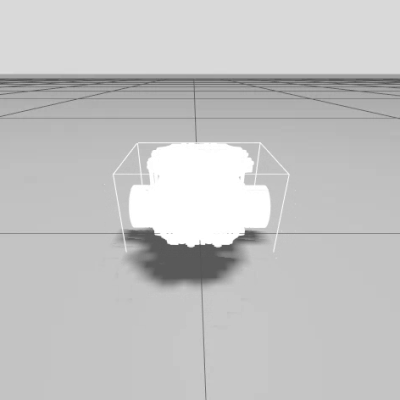
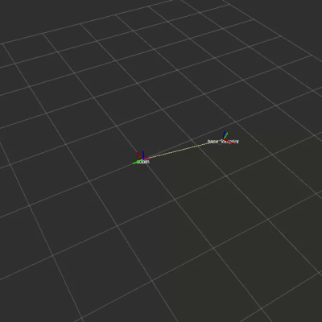

# TUTbot

  
  
   
  
  
   
  <em>TUTbot</em>

*TUTbot* or short for tutorial robot is a mobile robot that I am building to advance my understanding of robotic teleoperation, autonomous navigation, perception and simulation.

This repository contains the documentation, code, and resources for building and programming the TUTbot robot.

## Index
- [Assembly Guide](docs/assembly.md)
- [Visualization Setup](docs/setup_vis.md)
- [ROS2 Control Setup](docs/ros2_control.md)
- [Kinematics](docs/kinematics.md)
- [Odometry](docs/odometry.md)
- [Sensor Fusion](docs/sensor_fusion.md)

## Progress Table

| Task | Status |
|------|--------|
| Robot Assembly | Done |
| ROS setup | In Progress  |
| Setup PID control for motors | |
| URDF & Visualization | Done |
| Control | Done |
| Kinematics | Done |
| Odometry | Done |
| Probability & Sensor Fusion | In Progress |

## Acknowledgements
This project was created with help from Antonio Brandi's coursera course on ROS2. 

## License
This project is licensed under the MIT License - see the LICENSE file for details.