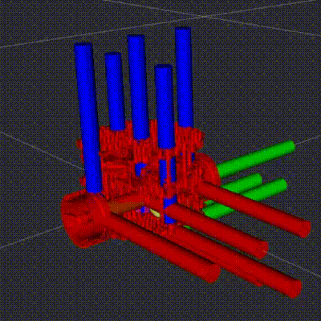
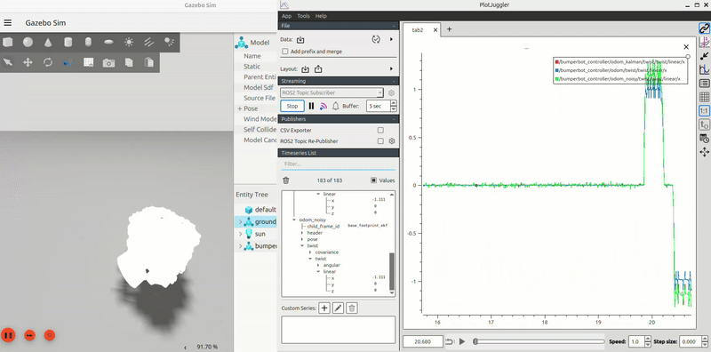
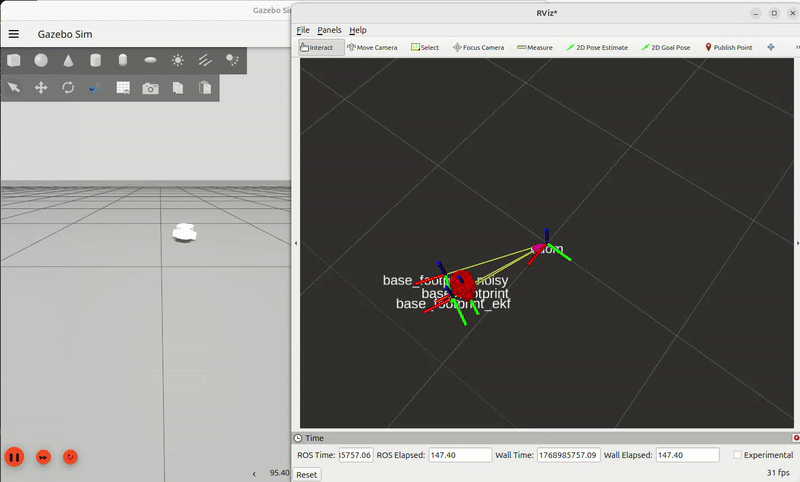

# TUTbot

  
  
   
  
  
   
  <em>TUTbot</em>

*TUTbot* or short for tutorial robot is a mobile robot that I am building to advance my understanding of robotic teleoperation, autonomous navigation, perception and simulation.

This repository contains the documentation, code, and resources for building and programming the TUTbot robot.

## Index
- [Assembly Guide](docs/assembly.md)
- [Visualization Setup](docs/setup_vis.md)
- [ROS2 Control Setup](docs/ros2_control.md)
- [Kinematics](docs/kinematics.md)
- [Odometry](docs/odometry.md)
- [Sensor Fusion](docs/sensor_fusion.md)
- [Mapping and Localization](docs/mapping_and_localization.md)
- [Arduino to ROS](docs/arduino_to_ros.md)

## Progress Table

| Task | Status |
|------|--------|
| Robot Assembly and Setup | Done |
| ROS setup | Done  |
| Setup PID control for motors | In Progress |
| Teleoperation | Done |
| URDF & Visualization | Done |
| Control | Done |
| Kinematics | Done |
| Odometry | Done |
| Probability & Sensor Fusion | Done |
| Mapping and Localization | In Progress |
| Navigation | In Progress |

## Some Visuals

### Noisy vs Clean odometry

 
Noisy vs Clean odometry

### Monocular Kalman Filter

 
Monocular Kalman Filter

### EKF based localization

 
EKF

### Teleoperation

 
Teleoperation with Joystick

 
Teleoperation with Turtlesim

### Trajectory mapper node

 
Trajectory mapper node

## Acknowledgements
This project was created with help from Antonio Brandi's course on ROS2. 

## License
This project is licensed under the MIT License - see the LICENSE file for details.