# TUTbot Assembly Guide
This is a walkthrough on how I designed and assembled the TUTbot robot.

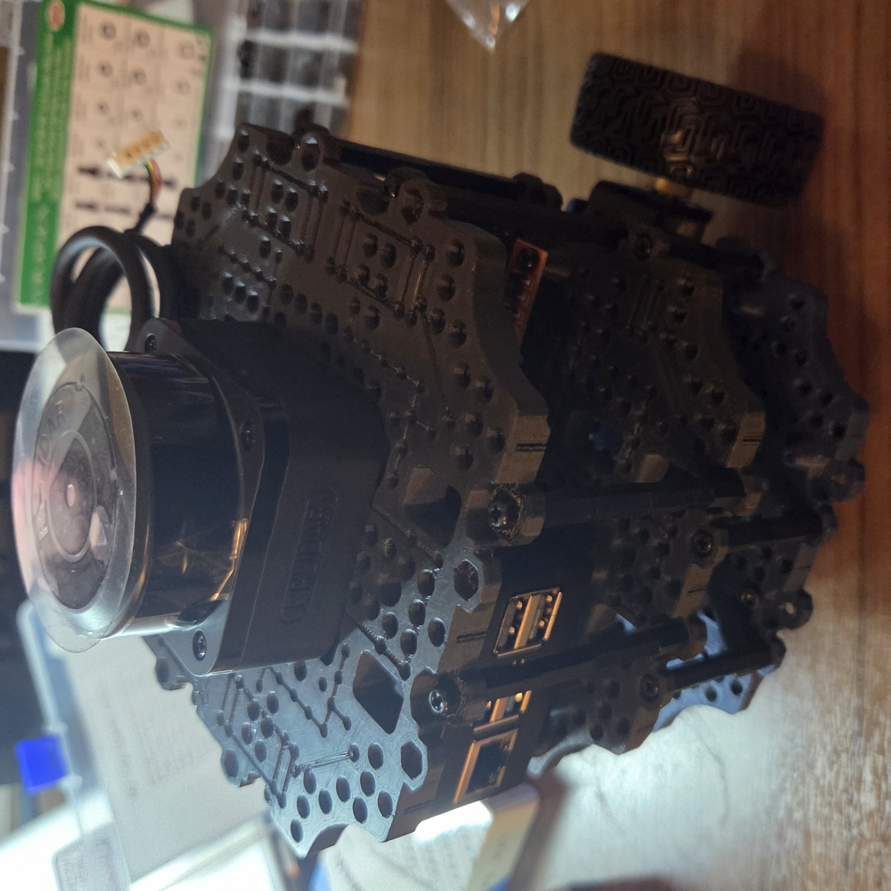

## Overview
The TUTbot is built using off-the-shelf components and 3D printed parts. The idea is to keep it simple and modular for easy upgrades. 

## Components List
- Chassis plates (base, middle and top) (1x each)
- Geared Motor with Quadrature Encoder and Mounting Bracket (2x)
- Wheels (2x)
- Raspberry pi 5 (with active cooling and case) (1x)
- rplidar C1 (1x)
- MPU6050 IMU (1x)
- LIPO 3S Battery pack (7.4V) - I am using a 5V 10A switching mode power supply and a power bank instead 
- Wemos d1 mini (for motor control and encoder reading)
- L298N motor driver (1x)
- 1.25" castor wheel (1x)
- prototyping components (perfboard, breadboard, terminal block, jumper wires)
- standoffs m3 (various lengths)
- screws and nuts (M2, M3, M4, various lengths)
- wire (26awg for low power and 18awg for high power)

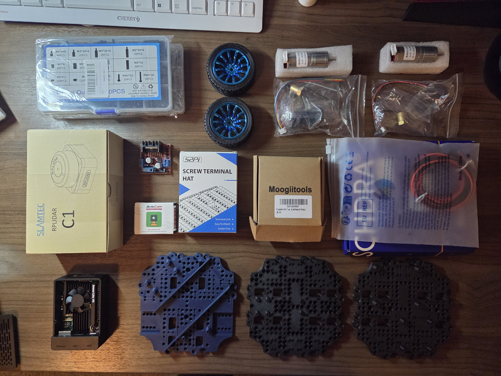

> the STL files for the chassis were sourced from AntoBrandi 
## Assembly Process

### Base Assembly

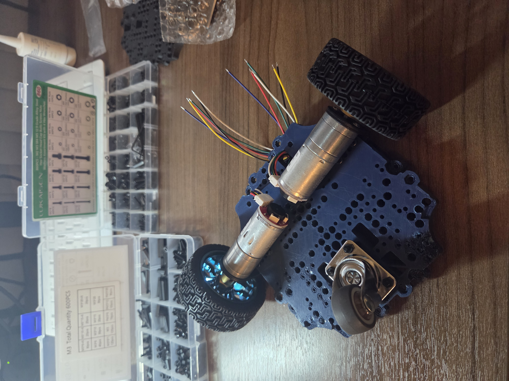
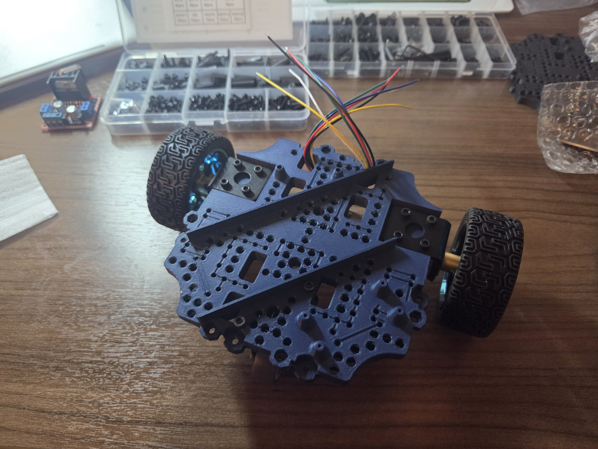

The motor came with mounting brackets, wheel and encoder cable. These need to be attached to the base plate using some M2 screws. I also mounted the 1.25" castor and to level the wheels with the castors, I used 6mm M3 standoffs. 

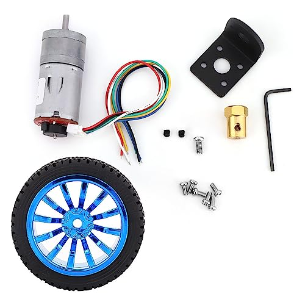
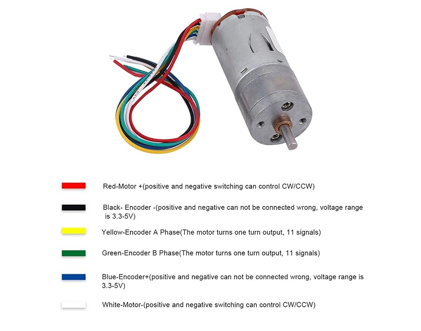

These motors use a quadrature encoder which is used to determine the angular position and direction of a rotating shaft by generating two square wave signals that are 90 degrees out of phase. I am using the Wemos D1 Mini to read these signals and control the motors via the L298N motor driver. I created a custom PCB to interface between the Wemos D1 Mini and the L298N motor driver (see the images below). Any microcontroller can be used here. I am using Wemos D1 Mini since I already have a few spares. Also make sure to use boot-safe pins with encoder connections, otherwise it may cause unexpected behavior during boot.

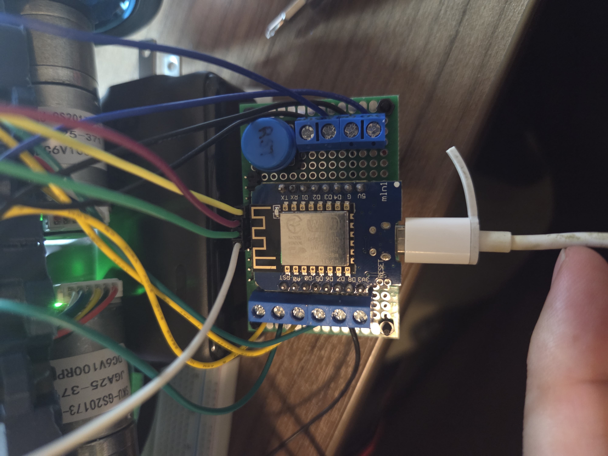

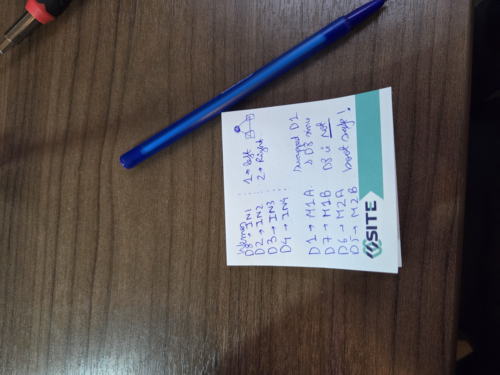

### Middle Assembly

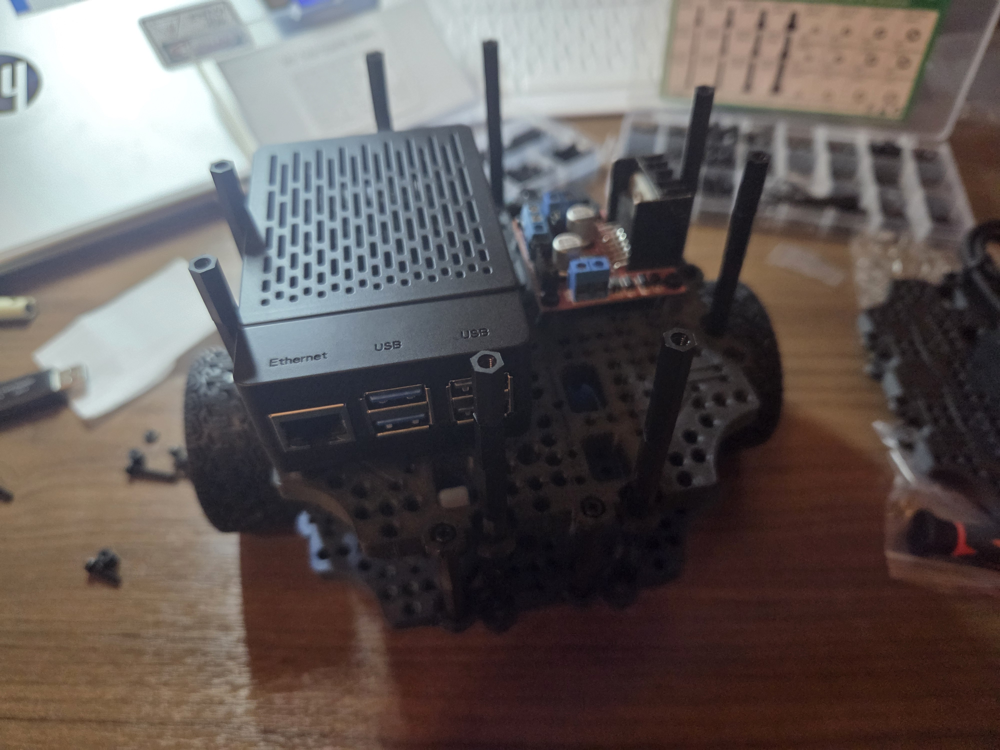

The middle plate holds the Raspberry Pi, L298N motor driver. The raspberry pi is mounted using M3 standoffs and screws. The L298N motor driver is mounted using M3 screws. I also used a short right-angle micro USB cable to connect the Raspberry Pi to the Wemos D1 Mini.

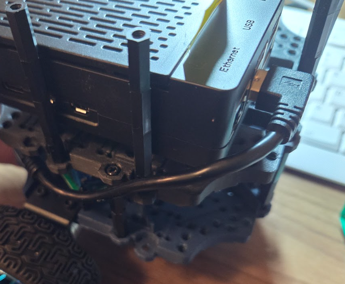

### Top Assembly

The top plate holds rplidar C1 and MPU6050 IMU. The rplidar C1 is mounted using M2.5 screws. The MPU6050 IMU is mounted using M3 screws. 
> additional care must be given to avoid damaging the rather closely located capacitor on MPU6050

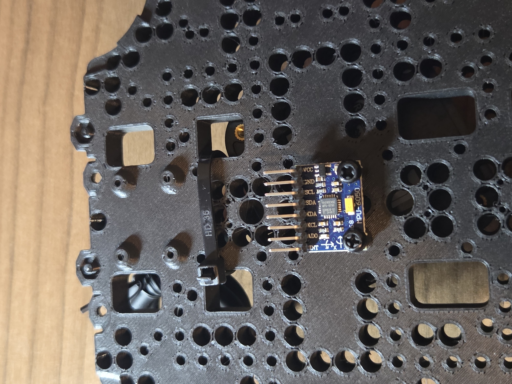

