# TUTbot Assembly Guide
This is a walkthrough on how I designed and assembled the TUTbot robot.
<div align="center">


</div>

## Overview
The TUTbot is built using off-the-shelf components and 3D printed parts. The idea is to keep it simple and modular for easy upgrades. 

## Components List

| Component | Quantity | Notes |
|-----------|----------|-------|
| Chassis plates (base, middle and top) | 1x each | 3D printed structural frame (download [STL*](../src/bumperbot_description/meshes/))|
| Geared Motor with Quadrature Encoder and Mounting Bracket | 2x | Main drive motors |
| Wheels | 2x | Compatible with geared motors |
| Raspberry pi 5 (with active cooling and case) | 1x | Main compute unit |
| rplidar C1 | 1x | 360° 2D LiDAR sensor |
| MPU6050 IMU | 1x | 6-axis IMU sensor |
| LIPO 3S Battery pack (7.4V) | 1x | Power source (using 5V 10A PSU + power bank instead) |
| Wemos d1 mini | 1x | Motor control and encoder reading |
| L298N motor driver | 1x | Motor controller |
| 1.25" castor wheel | 1x | Front support wheel |
| Prototyping components | - | Perfboard, breadboard, terminal block, jumper wires |
| Standoffs M3 | Various lengths | For component mounting |
| Screws and nuts (M2, M3, M4) | Various lengths | Fasteners |
| Wire | - | 26AWG (low power) and 18AWG (high power) |

<div align="center">
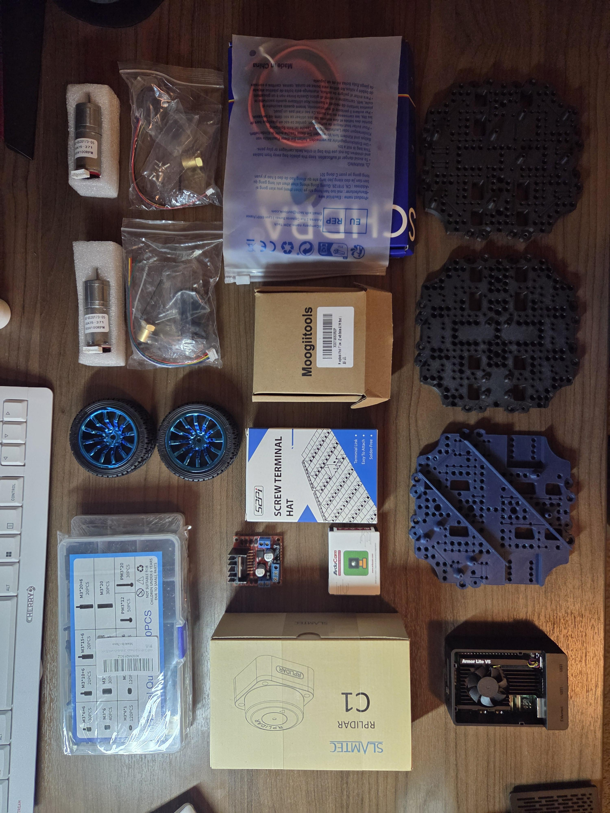
<br>
All the components required for the assembly
</div>

*the STL files for the chassis were sourced from AntoBrandi 
## Assembly Process

### Base Assembly

<div align="center">
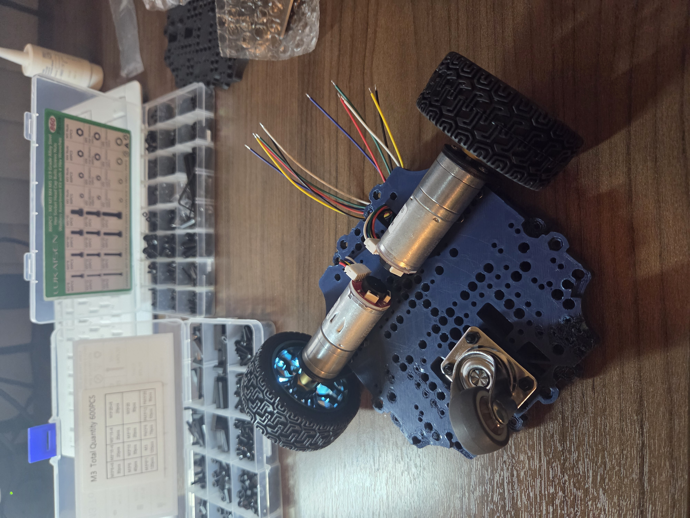
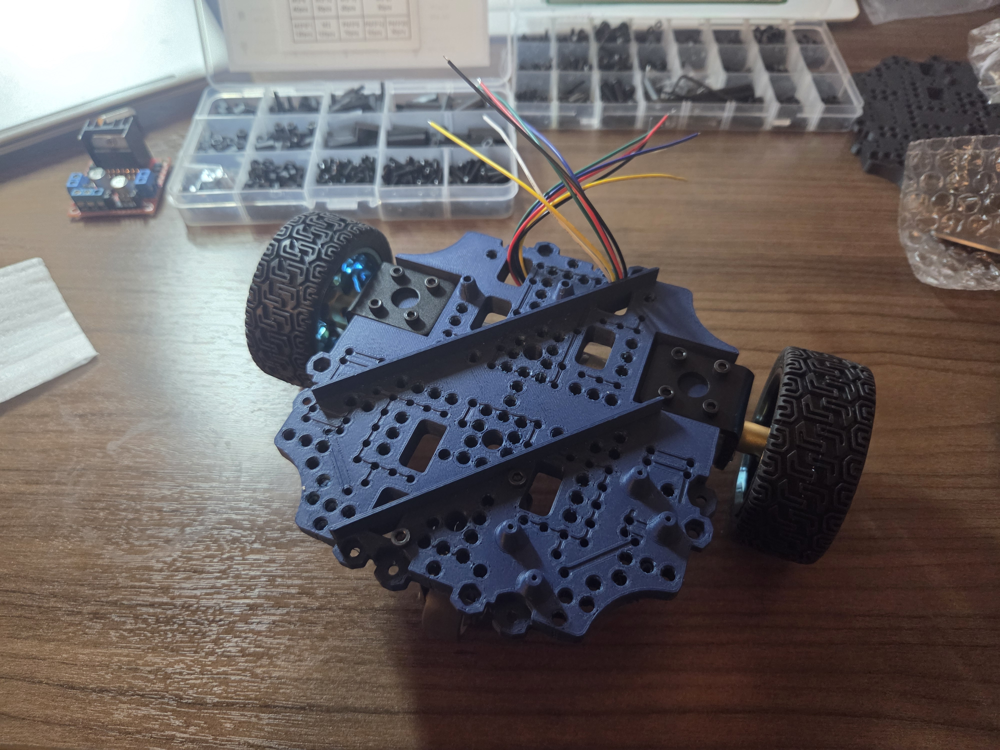
</div>

The motor came with mounting brackets, wheel and encoder cable. These need to be attached to the base plate using some M2 screws. I also mounted the 1.25" castor and to level the wheels with the castors, I used 6mm M3 standoffs. 

<div align="center">
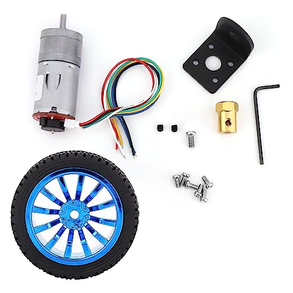
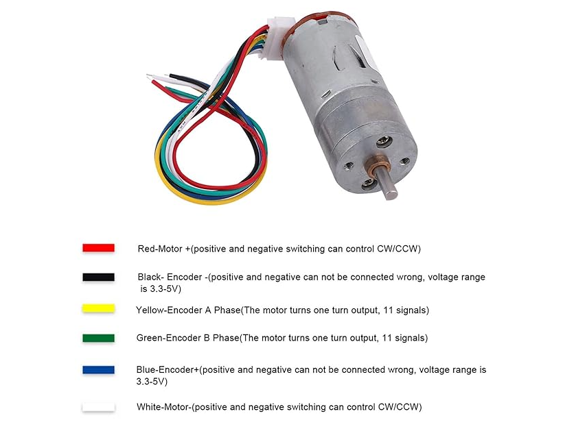
</div>
These motors use a quadrature encoder which is used to determine the angular position and direction of a rotating shaft by generating two square wave signals that are 90 degrees out of phase. I am using the Wemos D1 Mini to read these signals and control the motors via the L298N motor driver. I created a custom PCB to interface between the Wemos D1 Mini and the L298N motor driver (see the images below). Any microcontroller can be used here. I am using Wemos D1 Mini since I already have a few spares. Also make sure to use boot-safe pins with encoder connections, otherwise it may cause unexpected behavior during boot.

<div align="center">
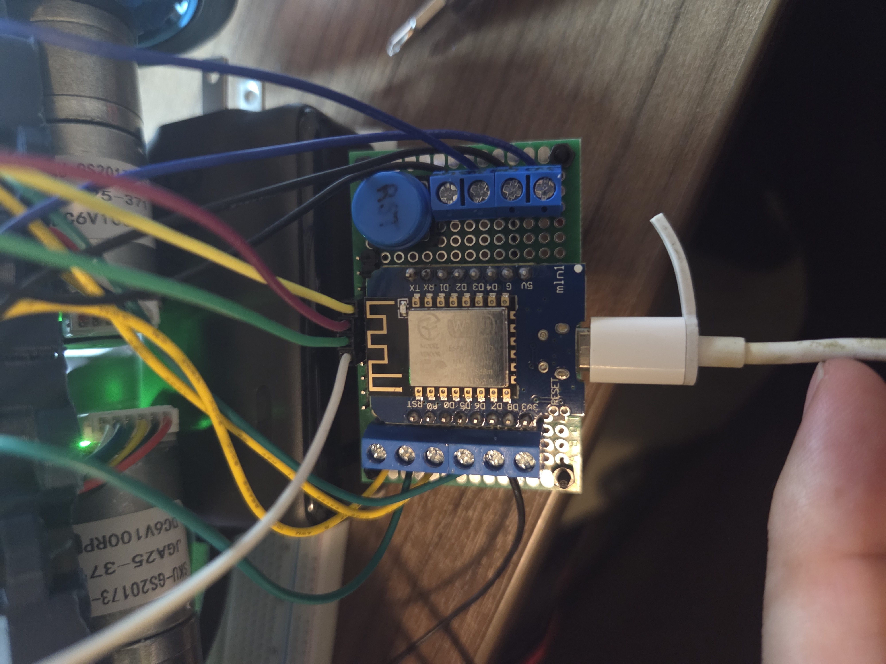
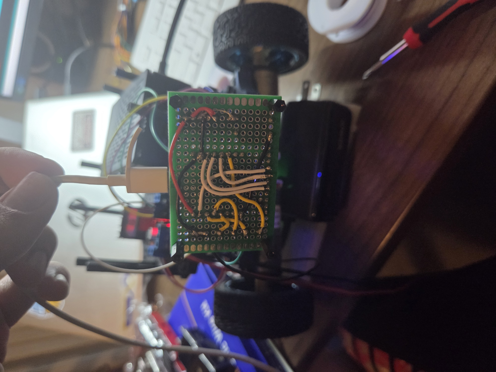
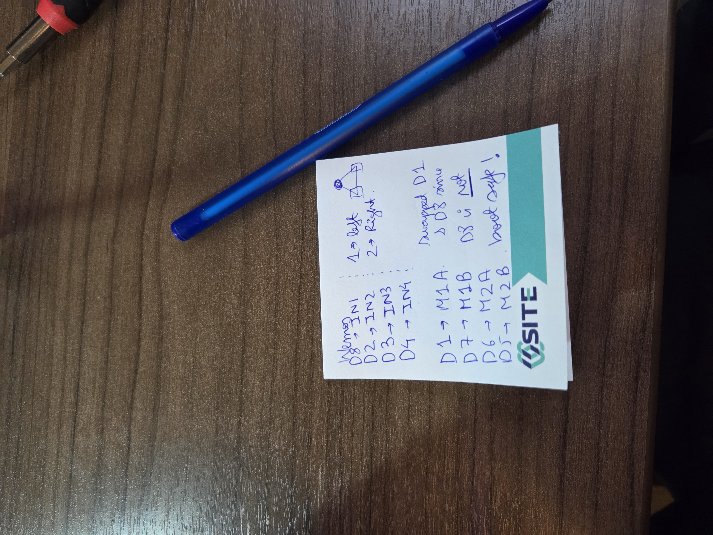
</div>

### Middle Assembly

<div align="center">
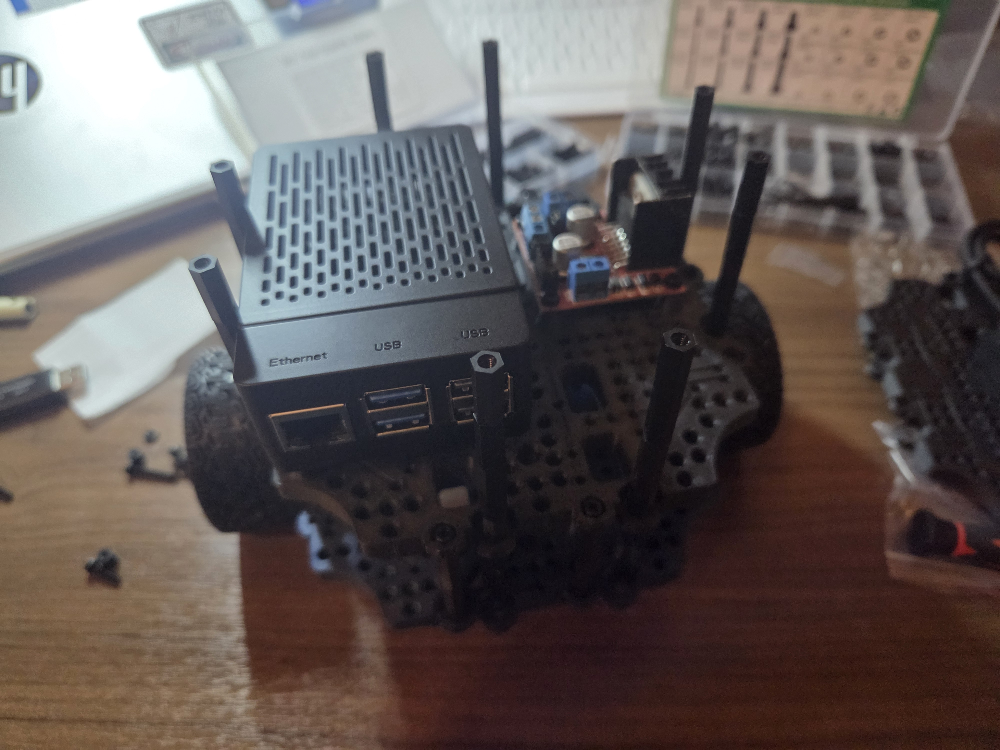
</div>

The middle plate holds the Raspberry Pi, L298N motor driver. The raspberry pi is mounted using M3 standoffs and screws. The L298N motor driver is mounted using M3 screws. I also used a short right-angle micro USB cable to connect the Raspberry Pi to the Wemos D1 Mini.

<div align="center">
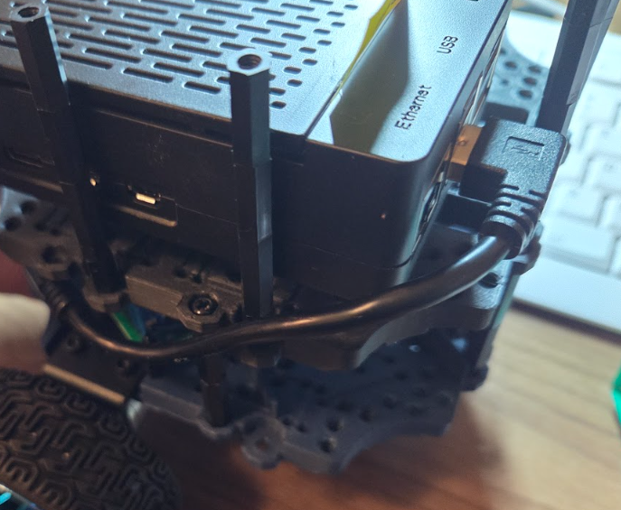
</div>

### Top Assembly

The top plate holds rplidar C1 and MPU6050 IMU. The rplidar C1 is mounted using M2.5 screws. The MPU6050 IMU is mounted using M3 screws. 
> additional care must be given to avoid damaging the rather closely located capacitor on MPU6050
<div align="center">
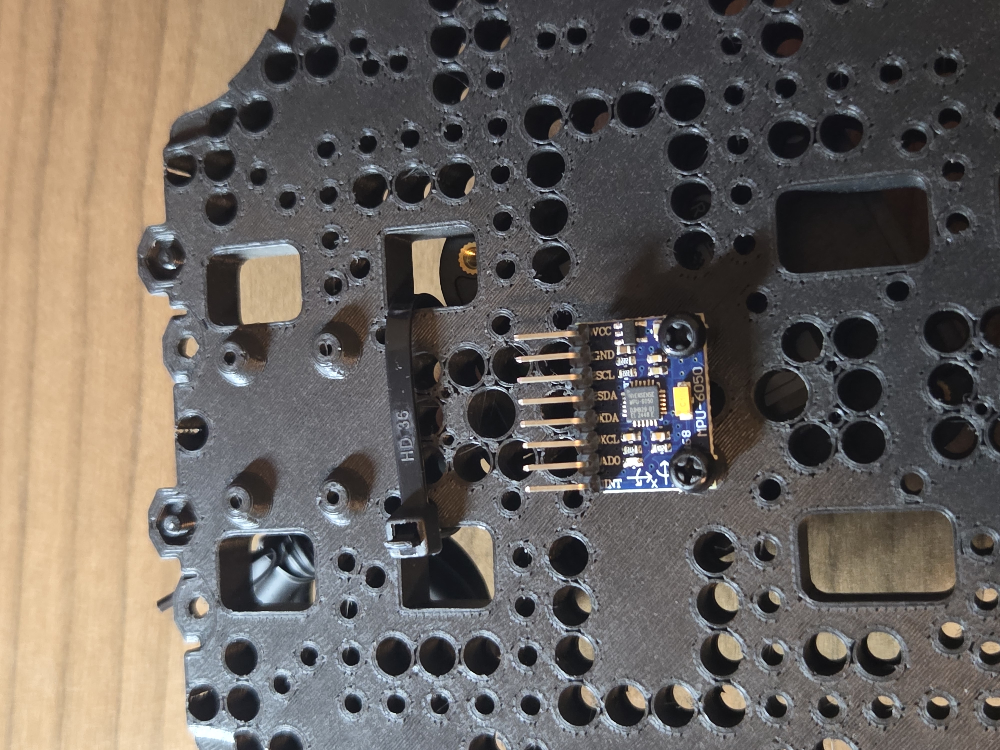

</div>

## Setup Desktop
### 1. [install ros2 jazzy and other dependancies](https://docs.ros.org/en/jazzy/Installation/Ubuntu-Install-Debs.html)
### 2. clone and build this repository

## Setup Raspberry Pi 5

### 1. [connecting via ssh](https://raspberrypi-guide.github.io/networking/connecting-via-ssh)

### 2. [get the pi a static ip](https://www.ionos.com/digitalguide/server/configuration/provide-raspberry-pi-with-a-static-ip-address/)

### 3. [install ros2 jazzy](https://docs.ros.org/en/jazzy/Installation/Ubuntu-Install-Debs.html)

### 4. Provide permissions to serial port
```bash
sudo usermod -a -G dialout $USER
```

### 5. Setup Bluetooth
#### Open the bluetoothctl interface
```bash
bluetoothctl
```
Inside the bluetoothctl interface, turn on bluetooth:
```bash
power on
```
Inside the bluetoothctl interface, scan for devices
```bash
scan on
```
Press the ps and share button together on the ps4 controller for a few seconds (rapid white blinking light should turn on)
The device should now appear in the list of available devices 
Look for "wireless controller"
```bash
[bluetooth]# [NEW] Device 58:10:31:06:22:B9 Wireless Controller
```
And copy the device address (58:10:31:06:22:B9 in this case)

#### Can exit bluetoothctl by typing `exit`

#### Pair with device
```bash
bluetoothctl pair 58:10:31:06:22:B9
Attempting to pair with 58:10:31:06:22:B9
[CHG] Device 58:10:31:06:22:B9 Connected: yes
[DEL] Device C8:38:32:31:67:5E Govee_H6076_675E
[CHG] Device 58:10:31:06:22:B9 WakeAllowed: yes
[CHG] Device 58:10:31:06:22:B9 ServicesResolved: yes
[CHG] Device 58:10:31:06:22:B9 Paired: yes
Pairing successful
```
#### Add to trusted devices
```bash
bluetoothctl trust 58:10:31:06:22:B9
```
This will allow the device to connect automatically

#### Restart bluetooth service
```bash
sudo systemctl restart bluetooth
```

#### Connect to the device
```bash
$ bluetoothctl connect 58:10:31:06:22:B9
Attempting to connect to 58:10:31:06:22:B9
[CHG] Device 58:10:31:06:22:B9 Connected: yes
[CHG] Device 58:10:31:06:22:B9 Paired: yes
```
Note: if connecting for the first time, even though you have paired, you still need to go to the pairing mode for a successful connection. Press the ps and share button together on the ps4 controller for a few seconds (rapid white blinking light should turn on)


#### Setup auto connection on boot
To avoid having to do all the above commands, we can modify the bluetooth configuration file:
```bash
sudo vim /etc/bluetooth/main.conf
```
Uncomment the following line
```bash
[General]
FastConnectable=false
```

#### Create a new udev rule 
A udev rule is a policy that tells Linux what to do when a device appears (USB, Bluetooth HID, serial, camera, joystick, CAN adapter, etc.).

```bash
cd /etc/udev/rules.d
```
80-89 are User/application rules
```bash
sudo touch 81-event.rules
```
```bash
sudo vim 81-event.rules
```
Add the following line in the file:
```bash
SUBSYSTEM=="input", KERNEL=="event*", GROUP="raspberry", MODE="0660"
```
By default, input devices are owned by root and inaccessible to normal users.
This rule allows non-root applications to read input events safely.

### 6. Clone and build the repo 
Build it using colcon and set the number of parallel workers to 2 due to low compute.
```bash
colcon build --parallel-workers 2
```

# RPLIDAR C1 Setup Guide

This guide will walk you through setting up the RPLIDAR C1 sensor for the TUTbot robot.

RPLIDAR C1 uses Time-of-Flight (ToF) and triangulation for distance measurement.
<div align="center">
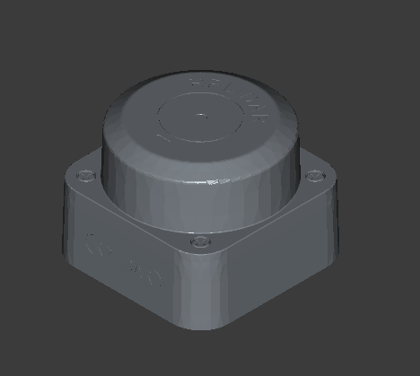
</div>

For installation and usage instructions, refer to the official repository:
[https://github.com/Slamtec/sllidar_ros2](https://github.com/Slamtec/sllidar_ros2)

## Features:
- 12m ranging radius
- 0.05m blind zone 
- 10Hz (600RPM) scanning frequency
- 0.72° angular resolution
- 5000 sampling rate
- UART communication (460800 baud)
- 30mm ranging accuracy
- 230mA power consumption

## Testing

To verify the RPLIDAR is working correctly:
1. Connect the RPLIDAR to UART to type-C converter
2. Connect the converter to the robot's USB port

    The lidar should be detected at `/dev/ttyUSB0`
    Give additional permissions: `sudo chmod 777 /dev/ttyUSB0`

3. Run `ros2 launch sllidar_ros2 view_sllidar_c1_launch.py` to start the RPLIDAR driver

### Rviz Display
Once the driver is running, open Rviz to visualize the LIDAR data

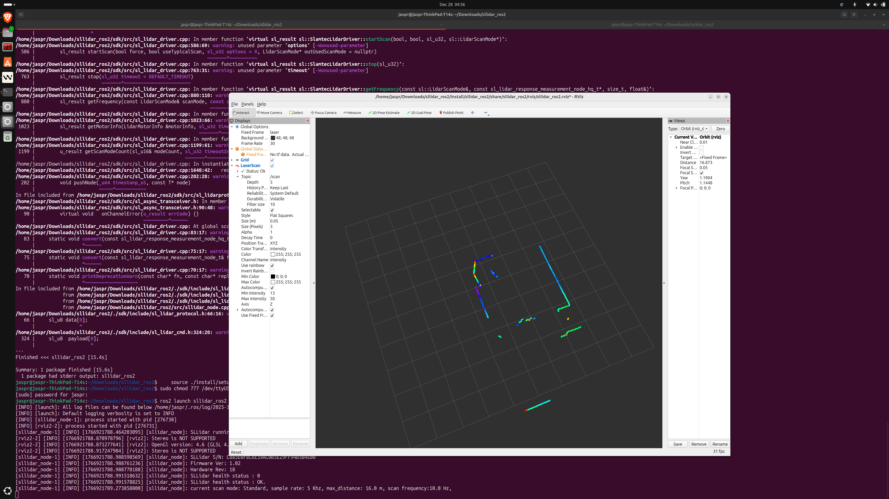
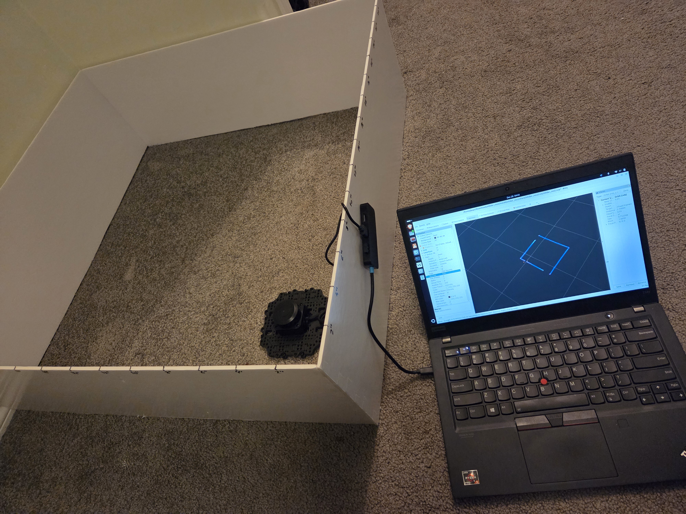

I created a 30x30x10" enclosure to perform basic tests. The Lidar measured distances accurately within the expected range (~74cm).

<!-- # Wemos D1 Mini Setup -->
<!-- 
<div align="center">

</div> -->