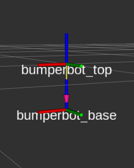
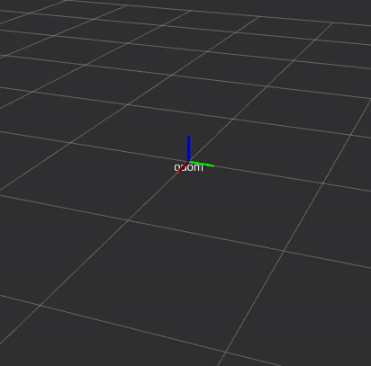
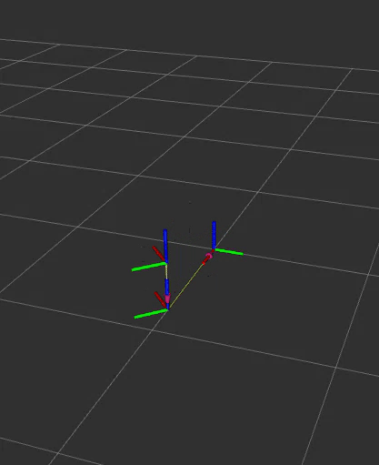
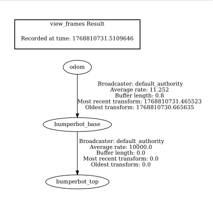

# Kinematics

Mobile robot kinematics describes how robots move through space. For a differential drive robot moving on a 2D plane, we can describe its pose (position and orientation) with respect to the global/world frame using 3 parameters: x, y, and θ (theta).

- **x, y**: Cartesian coordinates representing the robot's position in the world frame
- **θ (theta)**: Orientation angle representing the robot's rotation about the z-axis

## Turtlesim Example

Launch the turtlesim node:
```bash
ros2 run turtlesim turtlesim_node
```
In another window, launch turtle teleoperation:
```bash
ros2 run turtlesim turtle_teleop_key
```
<p align="center">
  
  <br>
  <em>Turtle sim teleop.</em>
</p>

Rqt graph:
```bash
ros2 run rqt_graph rqt_graph
```

Run ros2 topic list:
```bash
ros2 topic list
```
Output:
```
/parameter_events
/rosout
/turtle1/cmd_vel
/turtle1/color_sensor
/turtle1/pose
```
<p align="center">
  
  <br>
  <em>Rqt graph of turtlesim node and turtle_teleop_key node.</em>
</p>

> Here, nodes are ovals, topics are rectangles and edges indicate publish/subscribe relationships.

In this rqt_graph view, the running nodes are `/teleop_turtle` and `/turtlesim`, with communication occurring through several topics under the `/turtle1` namespace. The `/teleop_turtle` node publishes velocity commands on the `/turtle1/cmd_vel` topic, which is subscribed to by the `/turtlesim` node to move the turtle in the simulator. The `/turtlesim` node also provides the `/turtle1/rotate_absolute` action server, which expands into multiple topics: it publishes feedback on `/turtle1/rotate_absolute/_action/feedback` and status updates on `/turtle1/rotate_absolute/_action/status`, while an action client (implicit in the system) subscribes to these to monitor goal execution.

Since, we now know the velocity commands are published on the `/turtle1/cmd_vel` topic, we can now publish velocity commands to this topic to move the turtle in the simulator.

```bash
ros2 topic pub /turtle1/cmd_vel geometry_msgs/msg/Twist 'linear:
  x: 0.0
  y: 0.0
  z: 0.0
angular:
  x: 0.0
  y: 0.0
  z: 0.0
'
```

> Here, we are publishing a Twist message to the `/turtle1/cmd_vel` topic. The Twist message has two fields: linear and angular. The linear field has x, y, and z components, and the angular field has x, y, and z components.

We can also see the pose of the `/turtle1` by running the following command:
```bash
ros2 topic echo /turtle1/pose
```
Output:
```bash
---
x: 6.490523815155029
y: 3.875563144683838
theta: 0.2210351973772049
linear_velocity: 1.0
angular_velocity: 1.0
---
```
We can also spawn another turtle in the sim by:

```bash
ros2 service call /spawn turtlesim/srv/Spawn "x: 0.0
y: 5.0
theta: 20.0
name: 'turtle2'"
```
```bash
waiting for service to become available...
requester: making request: turtlesim.srv.Spawn_Request(x=0.0, y=5.0, theta=20.0, name='turtle2')

response:
turtlesim.srv.Spawn_Response(name='turtle2')
```
Now, both the turtles have separate topics being published and subscribed to. 
```bash
ros2 topic list

/parameter_events
/rosout
/turtle1/cmd_vel
/turtle1/color_sensor
/turtle1/pose
/turtle2/cmd_vel
/turtle2/color_sensor
/turtle2/pose
```
To now control turtle2 using teleop:
```bash
ros2 run turtlesim turtle_teleop_key --ros-args --remap turtle1/cmd_vel:=turtle2/cmd_vel
```
### Translation Vector and Rotation Matrix 

The pose topics `turtle1/pose` and `turtle2/pose` provide the position and orientation of each turtle with respect to the global frame (the bottom left corner of the turtlesim window).

#### Translation Vector
The translation vector from turtle1 to turtle2 represents the position of turtle2 expressed in turtle1's coordinate frame:

$$\mathbf{t}_{2}^{1} = \begin{bmatrix} T_x \\ T_y \end{bmatrix} = \begin{bmatrix} x_2 - x_1 \\ y_2 - y_1 \end{bmatrix}$$

#### Rotation Matrix
The rotation matrix defines the orientation of turtle2 with respect to turtle1:

$$
R_{2}^{1} = \begin{bmatrix} 
\cos\theta_{2}^{1} & -\sin\theta_{2}^{1} \\ 
\sin\theta_{2}^{1} & \cos\theta_{2}^{1} 
\end{bmatrix}
$$

where $\theta_{2}^{1} = \theta_2 - \theta_1$ is the relative orientation.

#### Homogeneous Transformation
The complete transformation from turtle1 to turtle2 combines both rotation and translation into a single homogeneous transformation matrix:

$$
T_{2}^{1} = \begin{bmatrix} 
R_{2}^{1} & \mathbf{t}_{2}^{1} \\ 
0_{1\times2} & 1
\end{bmatrix} = \begin{bmatrix} 
\cos\theta_{2}^{1} & -\sin\theta_{2}^{1} & T_x \\ 
\sin\theta_{2}^{1} & \cos\theta_{2}^{1} & T_y \\ 
0 & 0 & 1
\end{bmatrix}
$$

#### Implementation
A practical implementation is provided in [simple_turtlesim_kinematics.py](../src/bumperbot_py_examples/bumperbot_py_examples/simple_turtlesim_kinematics.py). To use it:

1. Spawn two turtles using the methods described above
2. Run the kinematics node:
```bash
ros2 run bumperbot_py_examples simple_turtlesim_kinematics
```

<p align="center">
  
  <br>
  <em>Translation vector and rotation matrix from turtle1 to turtle2 </em>
</p>

# Differential Kinematics 

### Robot Pose
The robot pose in the world frame is

$$
\mathbf{p} =
\begin{bmatrix}
x \\
y \\
\theta
\end{bmatrix}
$$

with time derivative

$$
\dot{\mathbf{p}} =
\begin{bmatrix}
\dot{x} \\
\dot{y} \\
\dot{\theta}
\end{bmatrix}
$$

### Wheel Parameters

- $r$ : wheel radius  
- $l$ : distance between left and right wheels (wheelbase)  
- $\dot{\phi}_R$ : right wheel angular velocity  
- $\dot{\phi}_L$ : left wheel angular velocity  

### Compact Function Form

$$
\dot{\mathbf{p}} = f(l, r, \theta, \dot{\phi}_R, \dot{\phi}_L)
$$
This is what we need to calculate to be able to send velocity commands to the robot.

### Body-Frame Velocities

Linear and angular velocities of the robot body:

$$
v = \frac{r}{2}(\dot{\phi}_R + \dot{\phi}_L)
$$

$$
\omega = \frac{r}{l}(\dot{\phi}_R - \dot{\phi}_L)
$$


### Differential Drive Velocity Mapping

The mapping from wheel velocities to body velocities is

$$
\mathbf{u}
=
\begin{bmatrix}
\frac{r}{2} & \frac{r}{2} \\
\frac{r}{l} & -\frac{r}{l}
\end{bmatrix}
\dot{\boldsymbol{\phi}}
$$

or explicitly,

$$
\begin{bmatrix}
v \\
\omega
\end{bmatrix}
=
\begin{bmatrix}
\frac{r}{2} & \frac{r}{2} \\
\frac{r}{l} & -\frac{r}{l}
\end{bmatrix}
\begin{bmatrix}
\dot{\phi}_R \\
\dot{\phi}_L
\end{bmatrix}
$$
On the left side we have the robot body velocities and on the right side we have the wheel velocities. 

This matrix is often referred to as the **kinematic coupling matrix** for a differential-drive robot.

We can also map it the other way around:

$$
\begin{bmatrix}
\dot{\phi}_R \\
\dot{\phi}_L
\end{bmatrix}
=
\begin{bmatrix}
\frac{1}{r} & \frac{l}{2r} \\
\frac{1}{r} & -\frac{l}{2r}
\end{bmatrix}
\begin{bmatrix}
v \\
\omega
\end{bmatrix} \tag{1}
$$

### Body-to-World Velocity Transformation

Connects the velocity of robot in body frame to the velocity of robot in world 

The robot body-frame velocity vector is

$$
\mathbf{u} =
\begin{bmatrix}
v \\
\omega
\end{bmatrix}
$$

The world-frame pose rate is given by

$$
\begin{bmatrix}
\dot{x} \\
\dot{y} \\
\dot{\theta}
\end{bmatrix}
=
\begin{bmatrix}
\cos\theta & -\sin\theta & 0 \\
\sin\theta & \cos\theta  & 0 \\
0          & 0           & 1
\end{bmatrix}
\begin{bmatrix}
v \\
0 \\
\omega
\end{bmatrix} \tag{2}
$$

or equivalently,

$$
\begin{bmatrix}
\dot{x} \\
\dot{y} \\
\dot{\theta}
\end{bmatrix}
=
\begin{bmatrix}
v\cos\theta \\
v\sin\theta \\
\omega
\end{bmatrix}
$$
    The body-frame velocity of a differential-drive robot consists of forward motion \(v\) and angular motion \(\omega\). The lateral velocity component is zero due to the nonholonomic (no side-slip) constraint of the wheels. The rotation matrix transforms these body-frame velocities into world-frame pose rates.

Using equations (1) and (2), we can calculate the equation which connects the overall velocity of the robot in the world frame to the rotation velocity of the wheels. This is called the **forward differential kinematics**.

On multiplying (1) and (2), we get: 

$$
\begin{bmatrix}
\dot{x} \\
\dot{y} \\
\dot{\theta}
\end{bmatrix}
=
\left(
\begin{bmatrix}
\cos\theta & -\sin\theta & 0 \\
\sin\theta & \cos\theta  & 0 \\
0          & 0           & 1
\end{bmatrix}
\right)
\left(
\begin{bmatrix}
\frac{r}{2} & \frac{r}{2} & 0 \\
0           & 0         & 0 \\
\frac{r}{l} & -\frac{r}{l} & 0
\end{bmatrix}
\right)
\left(
\begin{bmatrix}
\dot{\phi}_R \\
\dot{\phi}_L \\
0
\end{bmatrix}
\right)
$$

$$
\mathbf{\dot{\mathbf{p}}} = f(r, l, \theta, \dot{\phi}_R, \dot{\phi}_L)
$$

On simplifying the kinematic expression, we obtain the **Jacobian matrix** that maps wheel angular velocities to world-frame pose rates:

$$
\begin{bmatrix}
\dot{x} \\
\dot{y} \\
\dot{\theta}
\end{bmatrix}
=
\left(
\begin{bmatrix}
\frac{r}{2}\cos\theta & \frac{r}{2}\cos\theta \\
\frac{r}{2}\sin\theta & \frac{r}{2}\sin\theta \\
\frac{r}{l} & -\frac{r}{l}
\end{bmatrix}
\right)
\begin{bmatrix}
\dot{\phi}_R \\
\dot{\phi}_L
\end{bmatrix}
\tag{3}
$$

## Simple Speed Controller [[simple_controller.py]](../src/bumperbot_controller/bumperbot_controller/simple_controller.py)

Now, we have all the pre-requisites to implement the simple speed controller. 

Create a new file called [simple_controller.py](../src/bumperbot_controller/bumperbot_controller/simple_controller.py) in the `bumperbot_controller` package. 

In the class, we can define wheel radius and wheel separation as parameters and declare them using the `declare_parameter` method. 
```python
self.declare_parameter('wheel_radius', 0.033)
self.declare_parameter('wheel_separation', 0.17)
```
We will publish the wheel speeds to the topic `simple_velocity_controller/commands` and subscribe to the topic `bumperbot_controller/cmd_vel`. In the callback to subscription, we will calculate the wheel speeds using the kinematic expression (3) we calculated above and publish them to the topic `simple_velocity_controller/commands`.

```python
self.speed_conversion_ = np.array([[self.wheel_radius_/2, self.wheel_radius_/2],
                                           [self.wheel_radius_/self.wheel_separation_, -self.wheel_radius_/self.wheel_separation_]])
```
Next, we can modify the [controller.launch.py](../src/bumperbot_controller/launch/controller.launch.py) file to pass the parameters to the controller node. 
```python
    wheel_radius_arg = DeclareLaunchArgument(
        "wheel_radius",
        default_value="0.033",
    )
    wheel_separation_arg = DeclareLaunchArgument(
        "wheel_separation",
        default_value="0.17",
    )
```
For more details, refer to the [bumpberbot_controller](../src/bumperbot_controller) package.

The `--show-args` flag can be used to see the arguments that can be passed to the launch file. These can be passed as arguments to the launch file.

```bash
ros2 launch bumperbot_controller controller.launch.py --show-args
```
Output: 
```bash
Arguments (pass arguments as '<name>:=<value>'):

    'use_python':
        Use Python for controller manager
        (default: 'true')

    'wheel_radius':
        Wheel radius
        (default: '0.033')

    'wheel_separation':
        Wheel separation
        (default: '0.17')
```

We should see the topic `/bumperbot_controller/cmd_vel` topic after running the controller launch file and their should be correct setup messages displayed in the terminal for gazebo and simple_controller. 

Run gazebo `ros2 launch bumperbot_gazebo bumperbot.launch.py` and controller `ros2 launch bumperbot_controller controller.launch.py`.
GZ terminal should display something for both simple_velocity_controller and joint_state_broadcaster which we defined in the [bumperbot_controllers.yaml](../src/bumperbot_controller/bumperbot_controller/config/bumperbot_controllers.yaml) file. 
```bash
ros_test_ws/install/bumperbot_controller/share/bumperbot_controller/config/bumperbot_controllers.yaml -p use_sim_time:=true --param use_sim_time:=true 
[gazebo-2] [INFO] [1768547892.862081686] [controller_manager]: Configuring controller: 'simple_velocity_controller'
[gazebo-2] [INFO] [1768547892.863846881] [simple_velocity_controller]: configure successful
[gazebo-2] [INFO] [1768547892.947776603] [controller_manager]: Activating controllers: [ simple_velocity_controller ]
[gazebo-2] [INFO] [1768547892.948426164] [simple_velocity_controller]: activate successful
[gazebo-2] [INFO] [1768547892.948521374] [controller_manager]: Successfully switched controllers!
[gazebo-2] [INFO] [1768547893.168249378] [controller_manager]: Loading controller : 'joint_state_broadcaster' of type 'joint_state_broadcaster/JointStateBroadcaster'
[gazebo-2] [INFO] [1768547893.168382290] [controller_manager]: Loading controller 'joint_state_broadcaster'
[gazebo-2] [INFO] [1768547893.180661910] [controller_manager]: Controller 'joint_state_broadcaster' node arguments: --ros-args --params-file /home/jaspr/Documents/TUTbot/ros_test_ws/install/bumperbot_controller/share/bumperbot_controller/config/bumperbot_controllers.yaml -p use_sim_time:=true --param use_sim_time:=true 
[gazebo-2] [INFO] [1768547893.248758345] [controller_manager]: Configuring controller: 'joint_state_broadcaster'
[gazebo-2] [INFO] [1768547893.248936954] [joint_state_broadcaster]: 'joints' or 'interfaces' parameter is empty. All available state interfaces will be published
[gazebo-2] [INFO] [1768547893.273773149] [controller_manager]: Activating controllers: [ joint_state_broadcaster ]
[gazebo-2] [INFO] [1768547893.281656138] [controller_manager]: Successfully switched controllers!
```
Simple controller terminal should display something like this:
```bash
[INFO] [simple_controller.py-3]: process started with pid [73093]
[simple_controller.py-3] [INFO] [1768547892.366700139] [simple_controller]:  Using wheel radius: 0.033
[simple_controller.py-3] [INFO] [1768547892.367461813] [simple_controller]:  Using wheel separation: 0.17
[simple_controller.py-3] [INFO] [1768547892.375316157] [simple_controller]:  The speed conversion matrix is: [[ 0.0165      0.0165    ]
[simple_controller.py-3]  [ 0.19411765 -0.19411765]]
[spawner-2] [INFO] [1768547892.860621409] [spawner_simple_velocity_controller]: Loaded simple_velocity_controller
[spawner-2] [INFO] [1768547892.960000779] [spawner_simple_velocity_controller]: Configured and activated simple_velocity_controller
[INFO] [spawner-2]: process has finished cleanly [pid 73092]
[spawner-1] [INFO] [1768547893.247381777] [spawner_joint_state_broadcaster]: Loaded joint_state_broadcaster
[spawner-1] [INFO] [1768547893.293466639] [spawner_joint_state_broadcaster]: Configured and activated joint_state_broadcaster
[INFO] [spawner-1]: process has finished cleanly [pid 73091]
```

Next, to actually move the robot, we can publish to `/bumperbot_controller/cmd_vel` topic. 
> Sometimes the tab completion doesn't work directly to get the message template. Just paste the yaml in the terminal with a \\. 
```bash
ros2 topic pub /bumperbot_controller/cmd_vel geometry_msgs/msg/TwistStamped \ "{header: {stamp: {sec: 0, nanosec: 0}, frame_id: ''},
  twist: {linear: {x: 0.0, y: 0.0, z: 0.0},
          angular: {x: 0.0, y: 0.0, z: 0.5}}}"
```

<!-- include gif -->
<p align="center">

<br>
<em>Simple controller demo</em>
</p>

### Using turtlesim teleop with simple controller

Turtlesim teleop publishes messages to `turtle1/cmd_vel`. We can remap the topic to `/bumperbot_controller/cmd_vel` to use it with the simple controller. The teleop uses the `geometry_msgs/msg/Twist` format and not `geometry_msgs/msg/TwistStamped`, so we need to modify the simple controller to accept `geometry_msgs/msg/Twist`.

**Changes needed in `simple_controller.py`:**

- **Line 23**: Change `TwistStamped` to `Twist`
  ```python
  self.vel_sub_ = self.create_subscription(Twist, "bumperbot_controller/cmd_vel", self.vel_callback, 10)
  ```

- **Lines 31-32**: Switch `msg.twist` to `msg`
  ```python
  robot_speed = np.array([[msg.linear.x], 
  [msg.angular.z]])
  ```

<p align="center">
  
  <br>
  <em>Teleop with simple controller.</em>
</p>

## Using joystick teleop with simple controller

We can use the joystick teleop to control the robot. We can use the `joy_teleop` package to do this. 

<p align="center">
  
  <br>
  <em>Teleop with joystick.</em>
</p>

Implementation details are in the [joystick_teleop.launch.py](../src/bumperbot_controller/launch/joystick_teleop.launch.py) file. This file launches the joy_node from the `joy` package and the joy_teleop node from the `joy_teleop` package.
```python
joy_node = Node(
        package="joy",
        executable="joy_node",
        name="joystick",
        parameters=[os.path.join(get_package_share_directory("bumperbot_controller"), "config", "joystick_config.yaml")]
    )
joy_teleop = Node(
        package="joy_teleop",
        executable="joy_teleop",
        parameters=[os.path.join(get_package_share_directory("bumperbot_controller"), "config", "joystick_teleop.yaml")]
    )
```
#### joy package
The joy package provides a low-level interface between a physical joystick and ROS 2. Its joy_node reads raw input events from a joystick device exposed by the operating system (typically via /dev/input/js* on Linux) and publishes them as messages of type `sensor_msgs/msg/Joy`. These messages contain an array of axis values(analog sticks and triggers) and an array of button states(pressed or not pressed).

The [joystick_config.yaml](../src/bumperbot_controller/config/joystick_config.yaml) file configures parameters for the joy_node. The parameters are:
- `device_id`: The ID of the joystick device. This is typically 0 for the first joystick.
- `device_name`: The name of the joystick device. This is typically empty.
- `deadzone`: The deadzone of the joystick. This is the range of values where the joystick is considered to be at rest.
- `autorepeat_rate`: The autorepeat rate of the joystick. This is the rate at which the joystick is repeated when held down.
- `sticky_buttons`: This is whether to use sticky buttons or not.
- `coalesce_interval_ms`: This is the interval at which the joystick is coalesced.


#### joy_teleop package
The joy_teleop package operates at a higher semantic level. It subscribes to the `sensor_msgs/msg/Joy` messages published by the joy_node and maps joystick inputs to robot commands based on a user-defined configuration. 

The [joystick_teleop.yaml](../src/bumperbot_controller/config/joystick_teleop.yaml) file configures parameters for the joy_teleop node. The parameters are:
- `move`: This is the move configuration. It has the following parameters:
  - `type`: The type of the move configuration. This is typically `topic`.
  - `interface_type`: The interface type of the move configuration. This is typically `geometry_msgs/msg/TwistStamped`.
  - `topic_name`: The topic name of the move configuration. This is typically `/bumperbot_controller/cmd_vel`.
  - `deadman_buttons`: The deadman buttons of the move configuration. If this button is not pressed, the robot will not move as a safety measure. 
  - `axis_mappings`: The axis mappings of the move configuration. This maps the joystick axis to the robot's linear and angular velocity. 

The button and axis mapping can be found at https://github.com/Ar-Ray-code/ps_ros2_common. 

### To run:
#### Launch gazebo:
```bash
ros2 launch bumperbot_gazebo gazebo.launch.py
```
#### Launch simple controller:
```bash
ros2 launch bumperbot_controller simple_controller.launch.py
```
#### Launch joystick teleop:
```bash
ros2 launch bumperbot_controller joystick_teleop.launch.py
```
# TF2 
In ROS 2, **TF2** is used to keep track of multiple coordinate frames over time and to transform data between them. Transformations can be classified as **static** or **dynamic** based on whether they change with time.

## Static and Dynamic Transformations
Static transformations represent fixed, time-invariant relationships between coordinate frames. They are used for rigid connections such as sensor mounting offsets or fixed joints. Static transforms are published once on `/tf_static` and remain constant for the lifetime of the system, making them efficient and deterministic.

Dynamic transformations represent time-varying relationships between frames. They are used for robot motion, joint movement, and localization updates (e.g., odom → base_link). Dynamic transforms are continuously published on `/tf`, include timestamps, and allow TF2 to track how frames move relative to each other over time.

The information published in the `/tf` and `/tf_static` topics is used by other applications such as RViz to visualize the robot's state. 

### Lets create a simple static transform publisher
Example [simple_tf_kinematics.py](../src/bumperbot_py_examples/bumperbot_py_examples/simple_tf_kinematics.py)

We make use of the StaticTransformBroadcaster from the tf2_ros package to broadcast static transforms. 
This code creates and broadcasts a static transform from `bumperbot_base` to `bumperbot_top` frames:

- **Transform Setup**: Creates a `StaticTransformBroadcaster` and `TransformStamped` message
- **Frame Definition**: 
  - Parent frame: `bumperbot_base`
  - Child frame: `bumperbot_top`
- **Translation**: Positions top frame 0.3m above base frame (z-axis)
- **Rotation**: Identity quaternion (no rotation between frames)
- **Broadcast**: Sends the static transform to TF2 system

```bash
        self.static_tf_broadcaster_ = StaticTransformBroadcaster(self)
        # it accepts a TransformStamped message 
        self.static_transform_stamped_ = TransformStamped()
        self.static_transform_stamped_.header.stamp = self.get_clock().now().to_msg()
        self.static_transform_stamped_.header.frame_id = "bumperbot_base"
        self.static_transform_stamped_.child_frame_id = "bumperbot_top"

        # Defining the transformation from base to top frame
        # (i) making the bumperbot top frame 0.3m above the base frame
        self.static_transform_stamped_.transform.translation.x = 0.0
        self.static_transform_stamped_.transform.translation.y = 0.0
        self.static_transform_stamped_.transform.translation.z = 0.3
        # (ii) defining the rotation
        self.static_transform_stamped_.transform.rotation.x = 0.0
        self.static_transform_stamped_.transform.rotation.y = 0.0
        self.static_transform_stamped_.transform.rotation.z = 0.0
        self.static_transform_stamped_.transform.rotation.w = 1.0

        self.static_tf_broadcaster_.sendTransform(self.static_transform_stamped_)
```
Run the node:
```bash
ros2 run bumperbot_py_examples simple_tf_kinematics 
[INFO] [1768705266.941344186] [simple_tf_kinematics]: Publishing static transform between bumperbot_base and bumperbot_top frames
```
Reading from the /tf_static topic
```bash
ros2 topic echo /tf_static
transforms:
- header:
    stamp:
      sec: 1768705266
      nanosec: 923695020
    frame_id: bumperbot_base
  child_frame_id: bumperbot_top
  transform:
    translation:
      x: 0.0
      y: 0.0
      z: 0.3
    rotation:
      x: 0.0
      y: 0.0
      z: 0.0
      w: 1.0
---
```
This can also be visualized in RViz:
> Make sure to have TF2 added in RViz and set the fixed frame to `bumperbot_base`
<p align="center">
  
  <br>
  <em>TF Static visualization in RViz.</em>
</p>

### Lets create a simple dynamic transform publisher
Example [simple_tf_kinematics.py](../src/bumperbot_py_examples/bumperbot_py_examples/simple_tf_kinematics.py)

We will define a fixed frame `odom` and a moving frame `bumperbot_base`. The `bumperbot_top` frame will be a child of the `bumperbot_base` frame. The `bumperbot_base` frame will move linearly in the x-direction at a rate of 0.01 m/s. 

For this, we will use the `TransformBroadcaster` from the tf2_ros package. It is configured in a similar fashion. 
```python
self.dynamic_tf_broadcaster_ = TransformBroadcaster(self)
self.dynamic_transform_stamped_ = TransformStamped()
```
We will need helpers that are actually updating the position of the `bumperbot_base` frame. 
```python
# helpers for dynamic transforms [this is only for demo to make the transform move linearly in x-direction]
self.x_increment_ = 0.01
self.last_x_ = 0.0
```
Next, we will need to update the transform at a regular interval. We will use a timer for this. 
```python
self.timer_ = self.create_timer(0.1, self.timer_callback) # We will be updating the dynamic transform at 10 Hz
```
In the callback function, we can define the rotation and translation of the `bumperbot_base` frame with respect to the `odom` frame. 
<p align="center">
  
  <br>
  <em>TF Dynamic visualization in RViz.</em>
</p>

## Euler to Quaternion 
Now, lets make the frames rotate as well along with translating. I created another file [simple_tf_kinematics_2.py](../src/bumperbot_py_examples/bumperbot_py_examples/simple_tf_kinematics_2.py). 

To perform operations with quaternions, we will use the `tf_transformations` package. 

Helper variables to keep track:
```python
self.rotations_counter_ = 0
self.last_orientation_ = quaternion_from_euler(0.0, 0.0, 0.0)
self.orientation_increment_ =  quaternion_from_euler(0.0, 0.0, 0.05) # yaw will increment whenever the timer expires
```
Update the rotation logic to use the quaternion:
```python
q = quaternion_multiply(self.last_orientation_, self.orientation_increment_)

self.dynamic_transform_stamped_.transform.rotation.x = q[0]
self.dynamic_transform_stamped_.transform.rotation.y = q[1]
self.dynamic_transform_stamped_.transform.rotation.z = q[2]
self.dynamic_transform_stamped_.transform.rotation.w = q[3]
```
Increment the rotation counter and update the last orientation:
```python
self.rotations_counter_ += 1
self.last_orientation_ = q
```
We can also add logic to reverse the rotation after a certain number of rotations:
```python
if self.rotations_counter_ >= 100:
    self.orientation_increment_ = quaternion_inverse(self.orientation_increment_)
    self.rotations_counter_ = 0
```
<p align="center">
  
  <br>
  <em>TF Dynamic visualization in RViz (translation+rotation).</em>
</p>

## Implementation of a TF2 Listener [simple_tf_kinematics_2.py](../src/bumperbot_py_examples/bumperbot_py_examples/simple_tf_kinematics_2.py)

Create a new service `GetTransform.srv` in the [bumperbot_msgs](../src/bumperbot_msgs/bumperbot_msgs/srv/GetTransform.srv) package. 

```bash
# Request 
string frame_id
string child_frame_id
---
# Response
geometry_msgs/TransformStamped transform
bool success
```
> Here the success is to indicate if the service was able to find the transform between the frames. 

In the [simple_tf_kinematics_2.py](../src/bumperbot_py_examples/bumperbot_py_examples/simple_tf_kinematics_2.py) node, 
1. We will create `get_transform` service server 
```python
self.get_transform_srv_ = self.create_service(GetTransform, "get_transform", self.get_transform_callback)
```
This uses the GetTransform service message which we setup above. The callback is set to `get_transform_callback`, which we will setup in the next step.

2. We will create a listener using the `TransformListener` from the tf2_ros package which will be initialized with a `Buffer`. 
```python
self.tf_buffer_ = Buffer()
self.tf_listener_ = TransformListener(self.tf_buffer_, self)
```

3. In the callback function, we will use the `lookup_transform` function to get the transform between the frames. 
```python 
requested_transform = self.tf_buffer_.lookup_transform(request.frame_id, request.child_frame_id, rclpy.time.Time())
```
This will return a `TransformStamped` message which contains the transform between the frames. We will set the response to this message and return it. Also all of this will be enclosed within try and except block to set the value of success. 

Usage: \
Run the service:
```bash
ros2 run bumperbot_py_examples simple_tf_kinematics_2
```
Call the service:
```bash
ros2 service call /get_transform bumperbot_msgs/srv/GetTransform "frame_id: 'odom'
child_frame_id: 'bumperbot_base'"
```

## tf2 tools and utilities
### tf2_tools view_frames
```bash
ros2 run tf2_tools view_frames
```
This will listen and generate a graph of the frames in the TF2 tree and save it as a pdf.
```
[INFO] [1768810726.375039865] [view_frames]: Listening to tf data for 5.0 seconds...
[INFO] [1768810731.467791297] [view_frames]: Generating graph...
[INFO] [1768810731.471553975] [view_frames]: Result:tf2_msgs.srv.FrameGraph_Response(frame_yaml="bumperbot_top: \n  parent: 'bumperbot_base'\n  broadcaster: 'default_authority'\n  rate: 10000.000\n  most_recent_transform: 0.000000\n  oldest_transform: 0.000000\n  buffer_length: 0.000\nbumperbot_base: \n  parent: 'odom'\n  broadcaster: 'default_authority'\n  rate: 11.252\n  most_recent_transform: 1768810731.465523\n  oldest_transform: 1768810730.665635\n  buffer_length: 0.800\n")
[INFO] [1768810731.475528442] [view_frames]: Exporting graph in frames_2026-01-19_01.18.51.pdf file...
```
<p align="center">
  
  <br>
  <em>TF2 View Frames Utility.</em>
</p>

### tf2_ros tf2_echo
With this utility, we can get the transform between two frames.
#### between bumperbot_base and bumperbot_top
```bash
ros2 run tf2_ros tf2_echo bumperbot_base bumperbot_top
```
```
[INFO] [1768810995.124872471] [tf2_echo]: Waiting for transform bumperbot_base ->  bumperbot_top: Invalid frame ID "bumperbot_base" passed to canTransform argument target_frame - frame does not exist
At time 0.0
- Translation: [0.000, 0.000, 0.300]
- Rotation: in Quaternion (xyzw) [0.000, 0.000, 0.000, 1.000]
- Rotation: in RPY (radian) [0.000, -0.000, 0.000]
- Rotation: in RPY (degree) [0.000, -0.000, 0.000]
- Matrix:
  1.000  0.000  0.000  0.000
  0.000  1.000  0.000  0.000
  0.000  0.000  1.000  0.300
  0.000  0.000  0.000  1.000
```
> see here, the translation in z is 0.3. (fixed frame)

#### between bumperbot_base and odom
```bash
ros2 run tf2_ros tf2_echo bumperbot_base odom
```
```
[INFO] [1768811007.124179519] [tf2_echo]: Waiting for transform bumperbot_base ->  odom: Invalid frame ID "bumperbot_base" passed to canTransform argument target_frame - frame does not exist
At time 1768811008.7333502
- Translation: [-1.480, 0.000, 0.000]
- Rotation: in Quaternion (xyzw) [0.000, 0.000, 0.000, 1.000]
- Rotation: in RPY (radian) [0.000, -0.000, 0.000]
- Rotation: in RPY (degree) [0.000, -0.000, 0.000]
- Matrix:
  1.000  0.000  0.000 -1.480
  0.000  1.000  0.000  0.000
  0.000  0.000  1.000  0.000
  0.000  0.000  0.000  1.000
```
> see here, the translation in x is -1.48. (moving frame since x is incremented every 0.1 seconds)


