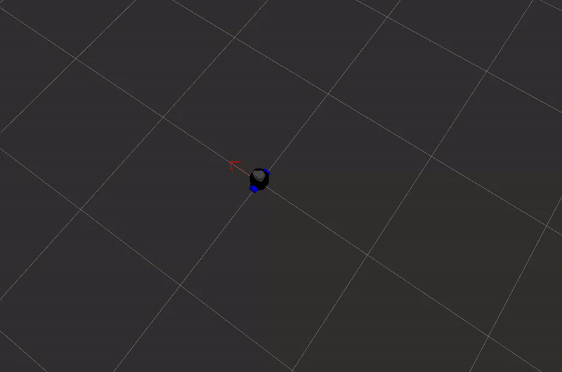
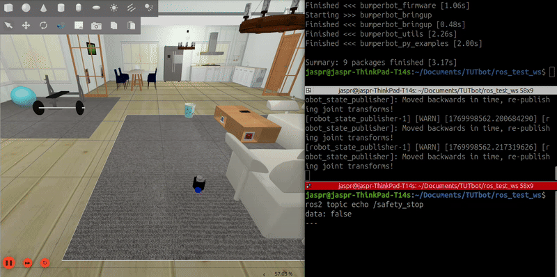
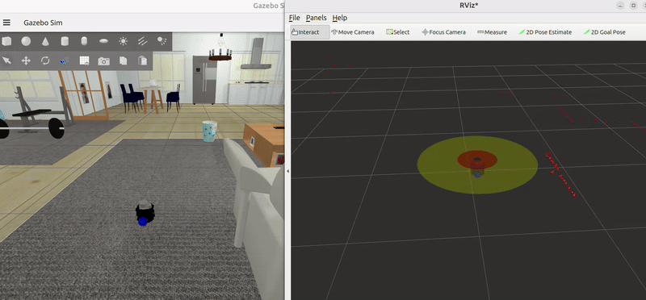
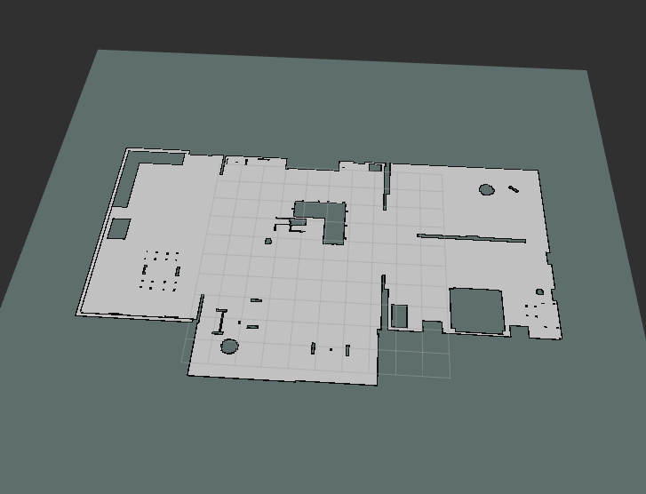
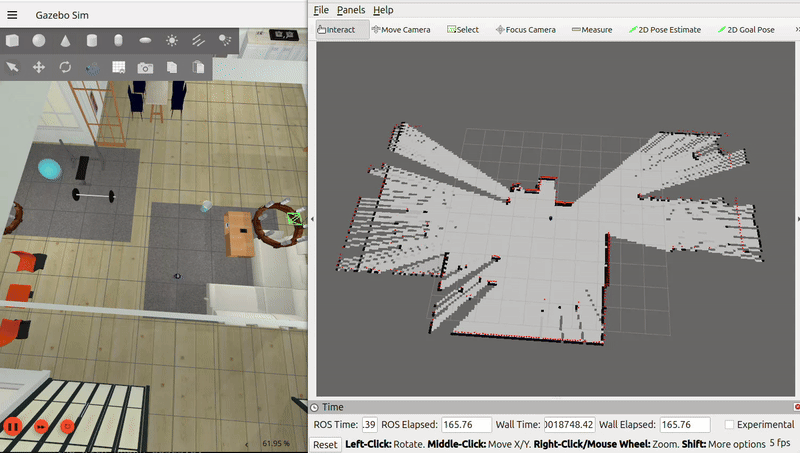
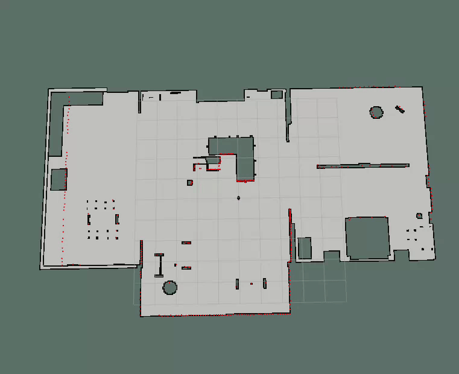
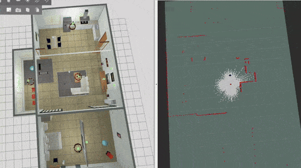

# Mapping and Localization

In mobile robotics, mapping and localization rely on a hierarchy of coordinate frames to describe the robot’s pose consistently over time. We adopt the standard ROS frame convention:

- `odom` frame: The local odometry frame. This frame provides a smooth, continuous estimate of the robot’s motion based on wheel encoders, IMU integration, or visual odometry. It is locally accurate but drifts over time.
- `base_link` frame: The robot’s body-fixed frame. This frame is rigidly attached to the robot and moves with it. All onboard sensors (LiDAR, camera, IMU) are defined relative to base_link.
- `map` frame: The global, world-fixed frame. This frame is used for long-term consistency, global planning, and loop-closure corrected localization. It does not drift, but estimates relative to it may jump when global corrections are applied.

#### Frame Relationships
- base_link is dynamic (time-varying).
- odom and map are fixed world frames (they do not move relative to the environment).

For example the if the robot starts always at the odom frame (lets say it is the charging dock) then there would be a fixed transformation from map frame to the odom frame. Then, one more transformation from odom frame to the non static base_link frame which moves with the robot. 

## 1. Local Localization / Odometry

Local localization, commonly referred to as **odometry**, estimates the robot’s pose relative to its starting position, without using any global map. It provides the transform between the `odom` and `base_link` frames and is typically computed using proprioceptive sensors such as wheel encoders, IMUs, or visual odometry. Odometry is designed to be smooth and continuous over time, making it well suited for short-term motion estimation and control.

However, odometry is inherently subject to drift due to sensor noise, wheel slip, and integration errors. This drift accumulates unbounded over time, meaning that while the relative motion estimate is locally accurate, the absolute pose of the robot in the environment becomes increasingly incorrect the longer the robot operates without correction.

### 1.1. Odometry Motion Model

The odometry motion model describes how the robot’s pose evolves over time based on incremental motion measurements obtained from odometry sensors (e.g., wheel encoders). The robot pose is represented as a state vector:

x = [x, y, θ]^T

where x and y define the position in the plane, and θ is the robot’s orientation.

Given a previous pose (x, y, θ), the new pose (x', y', θ') is computed by applying a relative motion composed of a translational displacement and rotational changes. The motion is parameterized by:

- δ̂_trans : estimated forward translation  
- δ̂_rot1  : estimated initial rotation  
- δ̂_rot2  : estimated final rotation  

The state update equations are:

x' = x + δ̂_trans · cos(θ + δ̂_rot1)  
y' = y + δ̂_trans · sin(θ + δ̂_rot1)  
θ' = θ + δ̂_rot1 + δ̂_rot2  

This formulation decomposes the robot’s motion into three sequential components: an initial rotation, a translation, and a final rotation. The first rotation (δ̂_rot1) aligns the robot with the direction of motion, allowing the translation to be applied along the correct heading. After translating, the second rotation (δ̂_rot2) accounts for the remaining change in orientation, ensuring that the robot reaches the correct final pose.

Using two rotations allows the model to represent general planar motion, including curved trajectories, using simple primitives. This decomposition closely approximates real robot motion and enables more accurate modeling of uncertainty, since rotational and translational errors can be treated separately.

While this motion model is simple and computationally efficient, it is inherently approximate. Errors in the estimated motion parameters accumulate over time due to wheel slip, uneven terrain, and sensor noise, leading to drift. As a result, the odometry motion model is well suited for short-term pose prediction and local localization, but requires global localization or sensor fusion to maintain long-term accuracy.

### 1.2. [odometry_motion_model.py](../src/bumperbot_localization/bumperbot_localization/odometry_motion_model.py) with Uncertainty

<p align="center">
<!-- gif -->

<br>
<em>Odometry Motion Model with Uncertainty</em>
</p>

In practice, odometry measurements are corrupted by noise arising from wheel slip, uneven terrain, encoder quantization, and unmodeled dynamics. To account for this uncertainty, the odometry motion model augments the noise-free motion parameters with stochastic error terms.

The true motion parameters are modeled as noisy versions of the ideal increments:

δ̂_rot1  = δ_rot1  − noise(α1 · |δ_rot1| + α2 · |δ_trans|)  
δ̂_trans = δ_trans − noise(α3 · |δ_trans| + α4 · (|δ_rot1| + |δ_rot2|))  
δ̂_rot2  = δ_rot2  − noise(α1 · |δ_rot2| + α2 · |δ_trans|)  

Here, `noise(·)` denotes a zero-mean random variable (typically Gaussian), and the parameters α1 through α4 control how different types of motion contribute to uncertainty.

- α1 models rotational noise proportional to rotation
- α2 models rotational noise induced by translation
- α3 models translational noise proportional to translation
- α4 models translational noise induced by rotation

These are defined as declarable parameters in the file along with number of parameters:
```py
self.declare_parameter('alpha1', 0.1)
self.declare_parameter('alpha2', 0.1)
self.declare_parameter('alpha3', 0.1)
self.declare_parameter('alpha4', 0.1)
self.declare_parameter('nr_samples', 300)
```

This formulation captures the empirical observation that translation and rotation errors are coupled: large translations tend to introduce orientation error, and large rotations tend to introduce position error. As a result, uncertainty grows anisotropically depending on the type of motion executed.

By explicitly modeling this noise, the odometry motion model can be used in probabilistic localization frameworks such as particle filters, where samples are drawn from the motion distribution rather than applying a deterministic state update. This allows the localization system to represent and propagate uncertainty over time, rather than relying on a single drifting pose estimate.

### 1.3. Speed and Separation Monitoring

#### This requires setting up `twist_mux` package. For more details see [twist_relay.py](../src/bumperbot_controller/bumperbot_controller/twist_relay.py).
This setup combines a twist relay node with twist_mux configuration files to manage multiple velocity command sources while enforcing safety and priority rules.

The twist relay node bridges stamped and unstamped velocity messages. It converts controller outputs from Twist to TwistStamped so downstream nodes can rely on time-stamped commands, and converts joystick inputs from TwistStamped back to Twist for interfaces that expect unstamped messages. The node does not modify velocities; it only adapts message formats to keep the control pipeline consistent.

The twist_mux joystick configuration defines how joystick commands are scaled and prioritized. The joystick_relay parameters enable priority handling and configure a turbo mode that sets minimum and maximum linear and angular velocities, along with discrete step levels. This limits and shapes joystick input so operator commands stay within safe, predefined speed ranges.

The twist_mux lock configuration sets up a high-priority safety lock. When the safety_stop topic is published with true, this lock immediately overrides all other velocity sources (priority 255) with no timeout, effectively stopping the robot and preventing motion until the lock is released.


A safety stop can be tested independently by publishing true to /safety_stop, which prevents the robot from moving when integrated with the safety logic.
```bash
ros2 topic pub /safety_stop std_msgs/msg/Bool "data: true"
```
If this topic is set to true, the robot will not move.

#### [safety_stop.py](../src/bumperbot_utils/bumperbot_utils/safety_stop.py)

The twist_mux topic configuration defines which velocity sources are allowed into the multiplexer and how they are arbitrated. Joystick and keyboard inputs are listed as separate topics, each with its own timeout and priority. Joystick commands are given higher priority than keyboard commands, and if a source stops publishing within its timeout window, it is automatically ignored. The `use_stamped: false` setting indicates that the mux operates on unstamped `Twist` messages.

Following this, a laser-based safety stop node is used to enforce speed and separation monitoring at runtime. This node continuously processes LiDAR data from the `LaserScan` topic and classifies the environment into three safety states: FREE, WARNING, and DANGER, based on configurable distance thresholds around the robot.

If an obstacle is detected within the warning distance, the system enters a WARNING state and proactively reduces the robot’s speed by issuing a `JoyTurbo` decrease action, effectively scaling down joystick velocity commands without stopping the robot. If an obstacle is detected within the danger distance, the node immediately transitions to the DANGER state and publishes `safety_stop = true`, which activates the high-priority safety lock in `twist_mux` and brings the robot to a complete stop.

When the surrounding area becomes clear again, the node returns to the FREE state, releases the safety stop, and restores normal operating speed by sending a `JoyTurbo` increase action. State changes are handled reactively, ensuring minimal latency between obstacle detection and control response.

For visualization and debugging, the node publishes RViz markers representing the warning and danger zones as concentric cylinders around the robot. These zones change transparency depending on the active safety state, providing intuitive real-time feedback of the robot’s current safety envelope.

Launch the simulated robot
```bash
ros2 launch bumperbot_bringup simulated_robot.launch.py world_name:=small_house
```
Launch the safety stop node
```bash
ros2 run bumperbot_utils safety_stop
```
<p align="center">

<br>
<em>Safety Stop in effect (robot stops right before collision)</em>
</p>

We can also add markers to visualize the warning and danger zones in RViz. 

<p align="center">

<br>
<em>Warning and danger zones in RViz</em>
</p>

### 1.4. Setup nav2_map_server (lifecycle node) 

[global_localization.launch.py](../src/bumperbot_localization/launch/global_localization.launch.py) file for this has been implemented in the bumperbot_localization package. 

Launch the map server
```bash
ros2 launch bumperbot_localization global_localization.launch.py map_name:=small_house
```
Ensure that the /map_server lifecycle node is in the active state. It should be since the launch file has nav2 lifecycle manager setup which initalizes the map server. 
```bash
ros2 lifecycle get /map_server
active [3]
```
To be able to visualize the map, we still need to make sure that the QoS settings are correct. 

In Rviz, we need to add a map layer and set the topic to `/map`. Set the topic /map reliability to transient local from volatile. The QoS settings should be compatible now and the map should appear in rviz. 

To investigate such issues, we can use the ros2 topic info with flag --verbose to see the QoS settings of the topic. 
```bash
ros2 topic info --verbose /map
```
<p align="center">

<br>
<em>Occupancy grid map</em>
</p>

## 1.5. Mapping with known poses 
Implementation details in [mapping_with_known_poses.py](../src/bumperbot_mapping/bumperbot_mapping/mapping_with_known_poses.py)

<p align="center">

<br>
<em>Mapping with known poses</em>
</p>

## 2. Global Localization

Global localization estimates the robot’s pose with respect to a known map and is responsible for correcting the drift accumulated by odometry. Rather than directly estimating `map to base_link`, it computes the transform between the `map` and `odom` frames, which indirectly places `base_link` in the global frame through the existing `odom to base_link` transform.

Global localization assumes that local localization is already available and reasonably accurate in the short term. It uses exteroceptive sensors such as LiDAR or cameras to match current observations against the map, producing global pose corrections. These corrections may be non-smooth or discontinuous but ensure long-term consistency and enable reliable global navigation and planning.

### 2.1. Mapping with known map (AMCL)
<p align="center">

<br>
<em>Adaptive Monte Carlo Localization</em>
</p>

## 3. SLAM (Simultaneous Localization and Mapping)
When mapping and localization are performed together, the system is referred to as SLAM.

<p align="center">

<br>
<em>factor graph based SLAM (from slam_toolbox)</em>
</p>