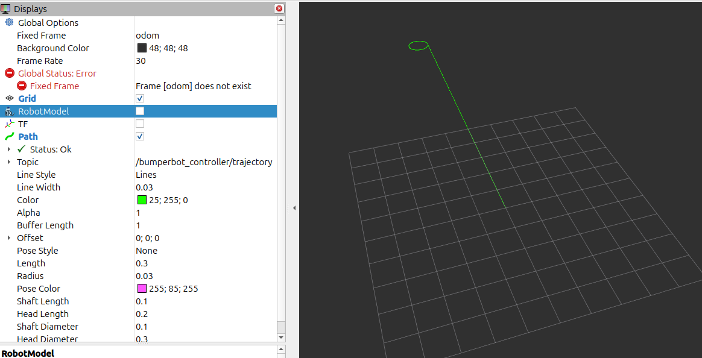
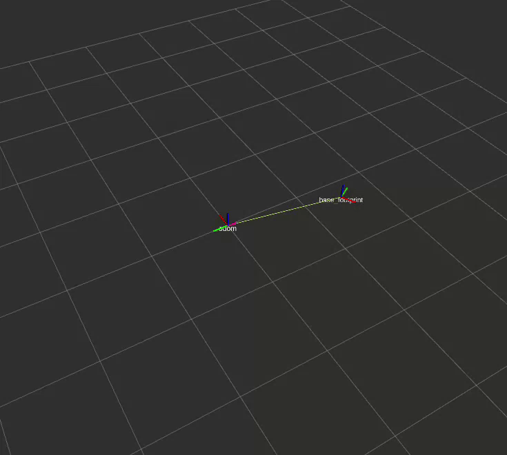

# Odometry
> this builds up on the equations in [kinematics.md](kinematics.md)

These equations compute angular velocity using a finite-difference approximation between two discrete time instants.

### Right Wheel Angular Velocity

$$
\dot{\psi}_R
=
\frac{\psi_R^{1} - \psi_R^{0}}{t_1 - t_0}
=
\frac{\Delta \psi_R}{\Delta t}
$$

- $\psi_R^{0}$ and $\psi_R^{1}$ are the right wheel angular positions at times $t_0$ and $t_1$
- $\Delta \psi_R$ is the change in right wheel angle
- $\Delta t$ is the elapsed time
- $\dot{\psi}_R$ is the right wheel angular velocity

### Left Wheel Angular Velocity

$$
\dot{\psi}_L
=
\frac{\psi_L^{1} - \psi_L^{0}}{t_1 - t_0}
=
\frac{\Delta \psi_L}{\Delta t}
$$
- $\psi_L^{0}$ and $\psi_L^{1}$ are the left wheel angular positions at times $t_0$ and $t_1$
- $\Delta \psi_L$ is the change in left wheel angle
- $\Delta t$ is the elapsed time
- $\dot{\psi}_L$ is the left wheel angular velocity

- This is a first-order (forward) finite-difference approximation of the time derivative.
- Assumes angular velocity is approximately constant over the interval $\Delta t$.

### Implementation of Differential Inverse Kinematics in [simple_controller.py](../src/bumperbot_controller/bumperbot_controller/simple_controller.py)
#### 1. Create a subscription to JointState topic
```python
self.joint_sub_ = self.create_subscription(JointState, "joint_states", self.joint_callback, 10)
```
#### 2. Create helper variables
```python
# odom vars for calculation of lin and angular velocities
self.left_wheel_prev_pos_ = 0.0
self.right_wheel_prev_pos_ = 0.0
self.prev_time_ = self.get_clock().now()
```
#### 3. Create joint_callback method
```python
def joint_callback(self, msg):
    # from the above formulas
    dp_left = msg.position[1] - self.left_wheel_prev_pos_
    dp_right = msg.position[0] - self.right_wheel_prev_pos_

    dt = Time.from_msg(msg.header.stamp) - self.prev_time_

    self.left_wheel_prev_pos_ = msg.position[1]
    self.right_wheel_prev_pos_ = msg.position[0]
    self.prev_time_ = Time.from_msg(msg.header.stamp)

    fi_left = dp_left/ (dt.nanoseconds / S_TO_NS)
    fi_right = dp_right/ (dt.nanoseconds / S_TO_NS)

    linear = self.wheel_radius_ * (fi_left + fi_right)/2
    angular = self.wheel_radius_ * (fi_right- fi_left)/self.wheel_separation_
```
publishing:
```bash
ros2 topic pub /bumperbot_controller/cmd_vel geometry_msgs/msg/TwistStamped \ "{header: {stamp: {sec: 0, nanosec: 0}, frame_id: ''},
twist: {linear: {x: 0.0, y: 0.0, z: 0.0},
        angular: {x: 0.0, y: 0.0, z: 0.5}}}"
```
Controller output:
```bash
[simple_controller.py-3] [INFO] [1768862014.303343070] [simple_controller]: Linear velocity: 0.500000  Angular velocity: -0.500000
```

## Calculating the Position and Orientation

### Position Calculation
Position is obtained by integrating velocity over time:

$$
\text{pos} = \int_0^t v\, dt
$$

Substitute the velocity expression:

$$
\text{pos}
=
\int_0^t
\left(
\frac{w_2}{2}\, \dot{\psi}_R
+
\frac{w_2}{2}\, \dot{\psi}_L
\right) dt
$$

#### Integrating

Split the integral:

$$
\text{pos}
=
\frac{w_2}{2} \int_0^t \dot{\psi}_R\, dt
+
\frac{w_2}{2} \int_0^t \dot{\psi}_L\, dt
$$

Since $\dot{\psi} = \frac{d\psi}{dt}$:

$$
\text{pos}
=
\frac{w_2}{2}(\psi_R^1 - \psi_R^0)
+
\frac{w_2}{2}(\psi_L^1 - \psi_L^0)
$$

#### Final Form

Using $\Delta \psi = \psi^1 - \psi^0$:

$$
\boxed{
\text{pos}
=
\frac{w_2}{2}\, \Delta \psi_R
+
\frac{w_2}{2}\, \Delta \psi_L
}
$$

### Orientation Calculation

Orientation is obtained by integrating angular velocity over time:

$$
\theta = \int_0^t \omega \, dt
$$

Substitute the angular velocity expression:

$$
\theta
=
\int_0^t
\left(
\frac{w_2}{w_s}\, \dot{\psi}_R
-
\frac{w_2}{w_s}\, \dot{\psi}_L
\right) dt
$$

#### Integrating

Split the integral:

$$
\theta
=
\frac{w_2}{w_s} \int_0^t \dot{\psi}_R\, dt
-
\frac{w_2}{w_s} \int_0^t \dot{\psi}_L\, dt
$$

Since $\dot{\psi} = \frac{d\psi}{dt}$:

$$
\theta
=
\frac{w_2}{w_s}(\psi_R^1 - \psi_R^0)
-
\frac{w_2}{w_s}(\psi_L^1 - \psi_L^0)
$$

#### Final Form

Using $\Delta \psi = \psi^1 - \psi^0$:

$$
\boxed{
\theta
=
\frac{w_2}{w_s}\, \Delta \psi_R
-
\frac{w_2}{w_s}\, \Delta \psi_L
}
$$

### Implementation of Wheel Odometry in [simple_controller.py](../src/bumperbot_control/scripts/simple_controller.py)
#### 1. Create helper vars for calculating position and orientation
```python
# helper vars for calculation of position and orientation (more details in odometry.md)
self.x_ = 0.0
self.y_ = 0.0
self.theta_ = 0.0
```
#### 2. Calculate the position and orientation as given by the above iterative formula
```python
d_s = (self.wheel_radius_ * dp_right + self.wheel_radius_ * dp_left) / 2
d_theta = (self.wheel_radius_ * dp_right - self.wheel_radius_ * dp_left) / self.wheel_separation_

self.theta_ += d_theta
self.x_ += d_s * np.cos(self.theta_)
self.y_ += d_s * np.sin(self.theta_)
```

Only setting angular velocity:
```bash
ros2 topic pub /bumperbot_controller/cmd_vel geometry_msgs/msg/TwistStamped \ "{header: {stamp: {sec: 0, nanosec: 0}, frame_id: ''},
twist: {linear: {x: 0.0, y: 0.0, z: 0.0},
        angular: {x: 0.0, y: 0.0, z: 0.5}}}"
```
Output from controller:
```bash
[simple_controller.py-3] [INFO] [1768863156.191632677] [simple_controller]: X: -0.000000  Y: -0.000000  Theta: -0.460000
[simple_controller.py-3] [INFO] [1768863156.200506786] [simple_controller]: Linear velocity: 0.000000  Angular velocity: -0.454545
[simple_controller.py-3] [INFO] [1768863156.201002977] [simple_controller]: X: -0.000000  Y: -0.000000  Theta: -0.465000
```

Setting both linear and angular velocity:
```bash
ros2 topic pub /bumperbot_controller/cmd_vel geometry_msgs/msg/TwistStamped \ "{header: {stamp: {sec: 0, nanosec: 0}, frame_id: ''},
  twist: {linear: {x: 0.5, y: 0.0, z: 0.0},
          angular: {x: 0.0, y: 0.0, z: 0.5}}}"
```

Output from controller:
```bash
[simple_controller.py-3] [INFO] [1768863313.094606193] [simple_controller]: Linear velocity: 0.454545  Angular velocity: -0.454545
[simple_controller.py-3] [INFO] [1768863313.095348528] [simple_controller]: X: -0.645854  Y: -0.234428  Theta: -11.865000
[simple_controller.py-3] [INFO] [1768863313.104856375] [simple_controller]: Linear velocity: 0.555556  Angular velocity: -0.555556
[simple_controller.py-3] [INFO] [1768863313.105714006] [simple_controller]: X: -0.642018  Y: -0.231221  Theta: -11.870000
[simple_controller.py-3] [INFO] [1768863313.116962023] [simple_controller]: Linear velocity: 0.454545  Angular velocity: -0.454545
[simple_controller.py-3] [INFO] [1768863313.118331775] [simple_controller]: X: -0.638166  Y: -0.228033  Theta: -11.875000
[simple_controller.py-3] [INFO] [1768863313.126214120] [simple_controller]: Linear velocity: 0.500000  Angular velocity: -0.500000
[simple_controller.py-3] [INFO] [1768863313.126813827] [simple_controller]: X: -0.634299  Y: -0.224864  Theta: -11.880000
[simple_controller.py-3] [INFO] [1768863313.136482617] [simple_controller]: Linear velocity: 0.500000  Angular velocity: -0.500000
[simple_controller.py-3] [INFO] [1768863313.137211536] [simple_controller]: X: -0.630415  Y: -0.221715  Theta: -11.885000
```

## Publish as Odometry message

### Updating [simple_controller.py](../src/bumperbot_controller/bumperbot_controller/simple_controller.py)

#### 1. Create `odom` publisher
```python
self.odom_pub_ = self.create_publisher(Odometry, "bumperbot_controller/odom", 10)
```
#### 2. Initialize the `odom` message
```python
self.odom_msg_ = Odometry()
self.odom_msg_.header.frame_id = "odom"
self.odom_msg_.child_frame_id = "base_footprint"
self.odom_msg_.pose.pose.position.x = 0.0
self.odom_msg_.pose.pose.position.y = 0.0
self.odom_msg_.pose.pose.position.z = 0.0
self.odom_msg_.pose.pose.orientation.x = 0.0
self.odom_msg_.pose.pose.orientation.y = 0.0
self.odom_msg_.pose.pose.orientation.z = 0.0
self.odom_msg_.pose.pose.orientation.w = 1.0
self.odom_msg_.twist.twist.linear.x = 0.0
self.odom_msg_.twist.twist.linear.y = 0.0
self.odom_msg_.twist.twist.linear.z = 0.0
self.odom_msg_.twist.twist.angular.x = 0.0
self.odom_msg_.twist.twist.angular.y = 0.0
self.odom_msg_.twist.twist.angular.z = 0.0
```
> here we set the parent to `odom` and child to `base_footprint`

#### 3. Update the `odom` message in the callback of `joint_callback`
```python
q = quaternion_from_euler(0, 0, self.theta_) # convert euler to quaternion
self.odom_msg_.pose.pose.orientation.x = q[0]
self.odom_msg_.pose.pose.orientation.y = q[1]
self.odom_msg_.pose.pose.orientation.z = q[2]
self.odom_msg_.pose.pose.orientation.w = q[3]
# update time stamp
self.odom_msg_.header.stamp = self.get_clock().now().to_msg()
# set position
self.odom_msg_.pose.pose.position.x = self.x_
self.odom_msg_.pose.pose.position.y = self.y_
self.odom_msg_.pose.pose.position.z = 0.0
# set twist
self.odom_msg_.twist.twist.linear.x = linear
self.odom_msg_.twist.twist.angular.z = angular
# publish the odom message
self.odom_pub_.publish(self.odom_msg_)
```
#### 4. Update CMake and Package.xml
Add the following to [CMakeLists.txt](../src/bumperbot_controller/CMakeLists.txt):
```cmake
find_package(nav_msgs REQUIRED)
```
Add the following to [package.xml](../src/bumperbot_controller/package.xml):
```xml
<depend>nav_msgs</depend>
<exec_depend>tf_transformations</exec_depend>
```
- <depend> is used for libraries, msg types, headers needed for compilation
- <exec_depend> is used for py packages, runtime tools, launch files

#### 5. Launch gazebo and the controller
You should see these two topics on doing ros2 topic list:
```bash
/bumperbot_controller/cmd_vel
/bumperbot_controller/odom
```
After a command has been sent to move the wheels using `ros2 topic pub /bumperbot_controller/cmd_vel`, the odom topic should start publishing messages.

on doing echo /bumperbot_controller/odom with `--no-arr` flag, you should see:
```bash
header:
  stamp:
    sec: 81
    nanosec: 50000000
  frame_id: odom
child_frame_id: base_footprint
pose:
  pose:
    position:
      x: -7.811611101906867e-14
      y: 1.0664628093562149e-14
      z: 0.0
    orientation:
      x: -0.0
      y: 0.0
      z: 0.12669531414103394
      w: -0.9919416804302079
  covariance: '<array type: double[36]>'
twist:
  twist:
    linear:
      x: 0.0
      y: 0.0
      z: 0.0
    angular:
      x: 0.0
      y: 0.0
      z: -0.4545454545450412
  covariance: '<array type: double[36]>'
```

Use `ros2 topic info /bumperbot_controller/odom --verbose` to see the details of the topic. \
Use `ros2 topic echo /bumperbot_controller/odom --no-arr` to see the details of the topic without arrays.

---

### Drawing the Robot's Trajectory
#### 1. Created a new package `bumperbot_utils`

```bash
ros2 pkg create --build-type ament_python bumperbot_utils
```

#### 2. Created a new node `simple_trajectory_plotter.py` in the package
Created two parameters: 
- `odom_topic` - The topic to subscribe to for odometry data (default: /bumperbot_controller/odom)
- `trajectory_topic` - The topic to publish the trajectory to (default: /bumperbot_controller/trajectory)

Everytime a message is received on the odom topic, the node publishes a new message on the trajectory topic.
Callback:
```python
pose_stamped = PoseStamped()
pose_stamped.header = msg.header
pose_stamped.pose = msg.pose.pose
self.traj_msg_.poses.append(pose_stamped)
self.trajectory_publisher_.publish(self.traj_msg_)  
```
> using PoseStamped() msg format to store each pose in the trajectory since nav_msgs/msg/Path expects a list of PoseStamped messages

#### 3. Launch gazebo, controller and then run the trajectory plotter node
```bash
ros2 run bumperbot_utils simple_trajectory_plotter
```

Send in a command: 
```bash
ros2 topic pub /bumperbot_controller/cmd_vel geometry_msgs/msg/TwistStamped \ "{header: {stamp: {sec: 0, nanosec: 0}, frame_id: ''},
  twist: {linear: {x: 0.0, y: 0.0, z: 0.0},
          angular: {x: 0.0, y: 0.0, z: 0.5}}}"
```
#### 4. Visualize in RViz
1. Set fixed frame to `odom`
2. Add a `Path` display with the topic `/bumperbot_controller/trajectory`

<p align="center">

<br>
Robot's trajectory
</p>

---

### Broadcasting the Odometry Transform 
#### update [simple_controller.py](../src/bumperbot_controller/bumperbot_controller/simple_controller.py)
##### 1. TransformBroadcaster
We will use `TransformBroadcaster()` to broadcast the odometry transform as we did earlier.
```python
self.tf_broadcaster_ = TransformBroadcaster(self)
self.tf_msg_ = TransformStamped()
self.tf_msg_.header.frame_id = "odom"
self.tf_msg_.child_frame_id = "base_footprint"
```
> parent is `odom`, child is `base_footprint`

##### 2. Update and publish transform
```python
self.tf_msg_.header.stamp = self.get_clock().now().to_msg()
self.tf_msg_.transform.translation.x = self.x_
self.tf_msg_.transform.translation.y = self.y_
self.tf_msg_.transform.translation.z = 0.0
self.tf_msg_.transform.rotation.x = q[0]
self.tf_msg_.transform.rotation.y = q[1]
self.tf_msg_.transform.rotation.z = q[2]
self.tf_msg_.transform.rotation.w = q[3]
self.tf_broadcaster_.sendTransform(self.tf_msg_)
```
#### Launch gazebo, RViz, and simple controller and send cmd_vel commands
<p align="center">

<br>
Odometry transform (fixed frame set to odom with TF enabled)
</p>