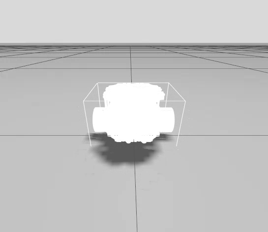

# ROS2 Control

ros2_control is a modular control framework for ROS 2 that provides a standardized way to connect controllers to robot hardware in a safe, real-time capable manner. It decouples control logic from hardware implementation, enabling reusable controllers, clean abstraction layers, and runtime flexibility.

### Diagram
```txt
                  +---------------------------+
                  |        Controllers        |
                  |---------------------------|
                  |  diff_drive_controller    |
                  |  joint_trajectory_ctrl    |
                  |  velocity_controller      |
                  +-------------+-------------+
                                |
                                | claims command/state interfaces
                                v
                  +---------------------------+
                  |     Controller Manager    |
                  |---------------------------|
                  |  - Load/unload controllers|
                  |  - Lifecycle management   |
                  |  - Deterministic update() |
                  |  - Service APIs           |
                  +-------------+-------------+
                                |
                                | interface arbitration requests
                                v
                  +---------------------------+
                  |      Resource Manager     |
                  |---------------------------|
                  |  - Owns hardware resources|
                  |  - Tracks interface usage |
                  |  - Prevents conflicts     |
                  +-------------+-------------+
                    ^                     |
                    | state interface     | command interface
                    |                     v
        +------------------------------------------------+
        |              Hardware Interfaces               |
        |------------------------------------------------|
        |  SystemInterface / ActuatorInterface / Sensor  |
        |                                                |
        |  left_wheel_joint:                             |
        |    - state: position, velocity, effort         |
        |    - command: velocity                         |
        |                                                |
        |  right_wheel_joint:                            |
        |    - state: position, velocity, effort         |
        |    - command: velocity                         |
        +----------------------+-------------------------+
                               |
                               | read() / write()
                               v
                  +---------------------------+
                  |     Physical Hardware     |
                  |---------------------------|
                  |  Motors, Encoders, IMU    |
                  |  CAN / UART / SPI / USB   |
                  +---------------------------+
```
### Controller Manager
The controller manager is responsible for loading, configuring, activating, and managing controllers (e.g., joint trajectory, velocity, position controllers) and connecting them to the robot hardware through standardized interfaces. Controllers are implemented as plugins, allowing each controller to be developed and deployed as a separate package.

Each controller claims specific command and state interfaces (such as position, velocity, or effort). The controller manager enforces exclusive ownership of command interfaces to prevent conflicts-multiple controllers cannot command the same joint or interface simultaneously.

The controller manager runs a deterministic control loop at a fixed update rate, invoking all active controllers each cycle. It also exposes ROS 2 services for runtime management (e.g., listing controllers, switching controllers, reloading parameters) and supports dynamic reconfiguration without restarting nodes.

### Controllers
Controllers are software components that implement specific control algorithms (e.g., position control, velocity control, trajectory following) and connect to the robot hardware through standardized interfaces. They are loaded and managed by the controller manager. Controllers are plugin-based components that operate on command and state interfaces exposed by hardware interfaces.

1. Joint-Level Controllers:

    - JointStateBroadcaster

      Publishes joint state information (position, velocity, effort). \
      Read-only; claims no command interfaces.

    - JointGroupPositionController
      Commands joint positions for multiple joints simultaneously.

    - JointGroupVelocityController

### Hardware Interfaces

A hardware interface is a plugin that defines how the robot’s physical hardware communicates with the control system. It implements one of the following interface types:

- SystemInterface: Manages complete systems with multiple joints and sensors
- ActuatorInterface: Controls individual actuators like motors
- SensorInterface: Reads data from sensors like encoders or IMUs

Hardware interfaces act as the bridge between abstract control commands and real hardware. They define which joints and sensors exist, and they expose state interfaces (read-only) and command interfaces (writeable) for those components.

Example interface definition:
```yaml
left_wheel_joint:
  command_interfaces: [position, velocity, effort]
  state_interfaces: [position, velocity, effort]
```

The hardware interface contains the robot-specific logic required to communicate with actuators and sensors over physical transports such as CAN, UART, serial, EtherCAT, or SPI, and implements the low-level read() and write() operations.

### Resource Manager

The resource manager is responsible for owning, tracking, and arbitrating access to hardware resources, including joints, sensors, and their associated command and state interfaces.

It loads and initializes hardware interface plugins and maintains a global registry of all available interfaces. State interfaces are shared and read-only (e.g., joint position, velocity, effort), while command interfaces are exclusive and writeable (e.g., position, velocity, effort commands).

The resource manager tracks which controller has claimed which command interfaces and ensures that no two controllers can command the same hardware resource at the same time. This arbitration guarantees safe controller switching and prevents conflicting actuator commands at runtime.

## Setup

### 1. Update [bumperbot_gazebo.urdf.xacro](../src/bumperbot_description/urdf/bumperbot_gazebo.urdf.xacro) 

#### a. Add is_ignition argument

```xml
    <!-- To denote we are using Ignition version of GZ-->
    <xacro:arg name="is_ignition" default="true"/>
```

#### b. Add ros2_control plugin

```xml
  <gazebo>
    <xacro:if value="$(arg is_ignition)">
      <!-- Ignition-specific gazebo configuration -->
      <plugin filename="ign_ros2_control-system" name="ign_ros2_control::IgnitionROS2ControlPlugin">
        <parameters>$(find bumperbot_controller)/config/bumperbot_controllers.yaml</parameters>
      </plugin>
    </xacro:if>
  </gazebo>
  <gazebo>
    <xacro:unless value="$(arg is_ignition)">
      <!-- Gazebo-specific gazebo configuration -->
      <plugin filename="gz_ros2_control-system" name="gz_ros2_control::GazeboSimROS2ControlPlugin">
        <parameters>$(find bumperbot_controller)/config/bumperbot_controllers.yaml</parameters>
      </plugin>
    </xacro:unless>
  </gazebo>
```

### 2. Create [bumperbot_ros2_control.urdf.xacro](../src/bumperbot_description/urdf/bumperbot_ros2_control.xacro) xacro file for ros2_control parameters

#### a. Add the plugin
```xml
    <xacro:if value="$(arg is_ignition)">
      <!-- Ignition-specific configuration -->
      <hardware>
        <plugin>ign_ros2_control/IgnitionSystem</plugin>
      </hardware>
    </xacro:if>

    <xacro:unless value="$(arg is_ignition)">
      <!-- Gazebo classic configuration -->
      <hardware>
        <plugin>gz_ros2_control/GazeboSimSystem</plugin>
      </hardware>
    </xacro:unless>
```
#### b. Add the hardware interfaces
```xml
<!-- each of the joint also needs a hardware interface -->
    <joint name="wheel_right_joint">
        <command_interface name="velocity">
            <!-- we can define limits here if needed -->
             <!-- defined in radians per second -->
             <param name="min">-1</param>
             <param name="max">1</param>
        </command_interface>
        <state_interface name="position"/>
        <state_interface name="velocity"/>
    </joint>
    
    <!-- hardware parameters for left wheel -->
    <joint name="wheel_left_joint">
        <command_interface name="velocity">
            <param name="min">-1</param>
            <param name="max">1</param>
        </command_interface>
        <state_interface name="position"/>
        <state_interface name="velocity"/>
    </joint>
```

### 3. Update exec dependancies in [bumperbot_description/package.xml](../src/bumperbot_description/package.xml)

```xml
  <exec_depend condition="$ROS_DISTRO >= iron">gz_ros2_control</exec_depend>
  <exec_depend condition="$ROS_DISTRO == humble">ign_ros2_control</exec_depend>
```

### 4. Configure ros2_control in yaml: [bumperbot_controllers.yaml](../src/bumperbot_controller/config/bumperbot_controllers.yaml) 

Define the controller_manager in the yaml file. Mention the update rate (hz) and set `use_sim_time` to true. Load and configure joint_state_broadcaster and simple_velocity_controller. For the velocity controller to work, add both the movable joints as parameters. 

```yaml
controller_manager:
  ros__parameters:
    update_rate: 100        # 100 hz rate
    use_sim_time: true

    # Load and configure controllers
    joint_state_broadcaster:
      type: joint_state_broadcaster/JointStateBroadcaster

    simple_velocity_controller:
      type: velocity_controllers/JointGroupVelocityController

simple_velocity_controller:
  ros__parameters:
    joints:
      - wheel_left_joint
      - wheel_right_joint
```

### 5. Add ros_distro env var in [bumperbot_description/gazebo.launch.py](../src/bumperbot_description/launch/gazebo.launch.py)

```py
    ros_distro = os.environ["ROS_DISTRO"]
    is_ignition = "True" if ros_distro == "humble" else "False"

    # update the robot description to also take is_ignition argument
    robot_description = ParameterValue(Command([
          "xacro ",
          LaunchConfiguration("model"),
          " is_ignition:=",
          is_ignition
      ]),
      value_type=str
   )
```

### 6. Launch gazebo by running `ros2 launch bumperbot_description gazebo.launch.py`

You should see ros2_control messages on the terminal which should indicate that the plugin has been loaded and the controller manager is running. 

```cmd
gazebo-2] [INFO] [1768008805.769159105] [gz_ros_control]: Loading controller_manager
[gazebo-2] [INFO] [1768008805.826655694] [controller_manager]: Using ROS clock for triggering controller manager cycles.
[gazebo-2] [INFO] [1768008805.830767832] [controller_manager]: Subscribing to '/robot_description' topic for robot description.
[gazebo-2] [WARN] [1768008805.833301836] [gz_ros_control]: Waiting RM to load and initialize hardware...
[gazebo-2] [WARN] [1768008806.830470467] [controller_manager]: Waiting for data on 'robot_description' topic to finish initialization
[gazebo-2] [INFO] [1768008807.185741979] [controller_manager]: Received robot description from topic.
[gazebo-2] [INFO] [1768008807.213354987] [gz_ros_control]: The position_proportional_gain has been set to: 0.1
[gazebo-2] [INFO] [1768008807.213589769] [gz_ros_control]: Loading joint: wheel_right_joint
[gazebo-2] [INFO] [1768008807.213606650] [gz_ros_control]:      State:
[gazebo-2] [INFO] [1768008807.213619253] [gz_ros_control]:               position
[gazebo-2] [INFO] [1768008807.213640873] [gz_ros_control]:               velocity
[gazebo-2] [INFO] [1768008807.213662072] [gz_ros_control]:      Command:
[gazebo-2] [INFO] [1768008807.213673032] [gz_ros_control]:               velocity
[gazebo-2] [INFO] [1768008807.213711954] [gz_ros_control]: Loading joint: wheel_left_joint
[gazebo-2] [INFO] [1768008807.213722894] [gz_ros_control]:      State:
[gazebo-2] [INFO] [1768008807.213734035] [gz_ros_control]:               position
[gazebo-2] [INFO] [1768008807.213750245] [gz_ros_control]:               velocity
[gazebo-2] [INFO] [1768008807.213765453] [gz_ros_control]:      Command:
[gazebo-2] [INFO] [1768008807.213779749] [gz_ros_control]:               velocity
[gazebo-2] [INFO] [1768008807.214045278] [controller_manager]: Initialize hardware 'RobotSystem' 
[gazebo-2] [WARN] [1768008807.214149519] [controller_manager]: Executor is not available during hardware component initialization for 'RobotSystem'. Skipping node creation!
[gazebo-2] [INFO] [1768008807.214314293] [controller_manager]: Successful initialization of hardware 'RobotSystem'
[gazebo-2] [INFO] [1768008807.214591523] [resource_manager]: 'configure' hardware 'RobotSystem' 
[gazebo-2] [INFO] [1768008807.214602563] [gz_ros_control]: System Successfully configured!
[gazebo-2] [INFO] [1768008807.214616970] [resource_manager]: Successful 'configure' of hardware 'RobotSystem'
[gazebo-2] [INFO] [1768008807.214632008] [resource_manager]: 'activate' hardware 'RobotSystem' 
[gazebo-2] [INFO] [1768008807.214651614] [resource_manager]: Successful 'activate' of hardware 'RobotSystem'
[gazebo-2] [WARN] [1768008807.214823099] [controller_manager]: Component 'RobotSystem' does not have read or write statistics initialized, skipping registration.
[gazebo-2] [INFO] [1768008807.214848757] [controller_manager]: Resource Manager has been successfully initialized. Starting Controller Manager services...
```

### 7. Create a launch file for the controller [controller.launch.py](../src/bumperbot_controller/launch/controller.launch.py)

Add the joint_state_broadcaster and simple_velocity_controller in the generate_launch_description function.

```py
def generate_launch_description():

    joint_state_broadcaster_spawner = Node(
        package='controller_manager',
        executable='spawner',
        arguments=['joint_state_broadcaster', 
        '--controller-manager', '/controller_manager'],
    )

    simple_controller = Node(
        package='controller_manager',
        executable='spawner',
        arguments=['simple_velocity_controller', 
        '--controller-manager', '/controller_manager'],
    )
    return LaunchDescription([
        joint_state_broadcaster_spawner,
        simple_controller
    ])
```

### 8. Put it all together

Run the gazebo and controller launch files

```bash
ros2 launch bumperbot_description gazebo.launch.py
ros2 launch bumperbot_controller controller.launch.py
```
Should see the following message in the gazebo terminal:
```cmd
[gazebo-2] [INFO] [1768009564.639336756] [controller_manager]: Configuring controller: 'joint_state_broadcaster'
[gazebo-2] [INFO] [1768009564.639535337] [joint_state_broadcaster]: 'joints' or 'interfaces' parameter is empty. All available state interfaces will be published
[gazebo-2] [INFO] [1768009564.668859112] [controller_manager]: Activating controllers: [ joint_state_broadcaster ]
[gazebo-2] [INFO] [1768009564.677927735] [controller_manager]: Successfully switched controllers!
```

Now we can use the ros2 control library to control the robot. 

#### a. List all the active controllers
```bash
ros2 control list_controllers
```
Should list all the active controllers:
```cmd
joint_state_broadcaster    joint_state_broadcaster/JointStateBroadcaster      active
simple_velocity_controller velocity_controllers/JointGroupVelocityController  active
```
#### b. List all the hardware interfaces
```bash
ros2 control list_hardware_interfaces
```
Should list all the hardware interfaces:
```cmd
[INFO] [1768009848.410315668] [_ros2cli_16709]: waiting for service /controller_manager/list_hardware_interfaces to become available...
command interfaces
	wheel_left_joint/velocity [available] [claimed]
	wheel_right_joint/velocity [available] [claimed]
state interfaces
	wheel_left_joint/position
	wheel_left_joint/velocity
	wheel_right_joint/position
	wheel_right_joint/velocity
```

#### c. List all hardware components
```bash
ros2 control list_hardware_components
```
Should list all the hardware components:
```cmd
Hardware Component 1
	name: RobotSystem
	type: 
	plugin name: 
	state: id=3 label=active
	read/write rate: 0 Hz
	is_async: False
	command interfaces
		wheel_right_joint/velocity [available] [claimed]
		wheel_left_joint/velocity [available] [claimed]
```

#### d. Make the robot move!
```cmd
ros2 topic list
```
Should list all the topics. Notice `/simple_velocity_controller/commands` topic. 
```cmd    
/controller_manager/activity
/controller_manager/introspection_data/full
/controller_manager/introspection_data/names
/controller_manager/introspection_data/values
/controller_manager/statistics/full
/controller_manager/statistics/names
/controller_manager/statistics/values

/simple_velocity_controller/commands
/simple_velocity_controller/transition_event
```
Now, we can directly publish a message to this topic. To figure what type of message type it requires use tab completion.
```cmd
ros2 topic pub /simple_velocity_controller/commands 
-1                                       --qos-profile
...
--print                                  std_msgs/msg/Float64MultiArray
```
Similarly, the message template can also be automatically added by using tab completion. 

Final command should look like:

```cmd
ros2 topic pub /simple_velocity_controller/commands std_msgs/msg/Float64MultiArray 'layout:
  dim: []
  data_offset: 0
data: []
' --once
```
> --once can be added if you want to publish only once 

Add the relevant velocities to the data array to make the robot move. 

Moving both motors with same speed:

```cmd
ros2 topic pub /simple_velocity_controller/commands std_msgs/msg/Float64MultiArray 'layout:
  dim: []
  data_offset: 0
data: [1,1]'
```

Inplace rotation:

```cmd
ros2 topic pub /simple_velocity_controller/commands std_msgs/msg/Float64MultiArray 'layout:
  dim: []
  data_offset: 0
data: [1,-1]'
```
<p align="center">

<br>
<em>Robot moving forward and then rotating in place</em>
</p>
