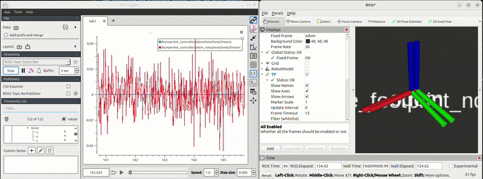
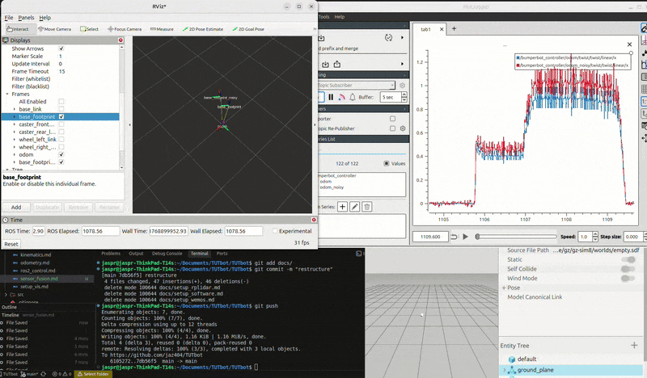

# Sensor Fusion
## Adding noise to robot motion
### Why add noise?
Real world sensors and actuators are never perfect. Adding noise to the robot's motion models helps to simulate real world conditions and test the robustness of the robot's control algorithms. 

### Implementing [noisy_controller.py](../src/bumperbot_controller/bumperbot_controller/noisy_controller.py) 

We do want to re-implement the code for conversion of the wheel commands to velocity commands of wheels this will still be done by the simple_controller. In the noisy controller, we only want to introduce noise and errors in the odometry calculation and so in the robot localization. So, we will be required to run both. For true values, we will use the simple_controller and for noisy values, we will use the noisy_controller. 
This means both controllers can run simultaneously:
- **`simple_controller`** → `/bumperbot_controller/odom` (clean odometry)
- **`noisy_controller`** → `/bumperbot_controller/odom_noisy` (noisy odometry)

#### 1. Remove the additional logic:
##### We no longer need to publish wheel commands or subscribe to velocity commands. The following lines can be deleted. 
```python
self.wheel_cmd_pub_ = self.create_publisher(Float64MultiArray, "simple_velocity_controller/commands", 10)
self.vel_sub_ = self.create_subscription(TwistStamped, "bumperbot_controller/cmd_vel", self.vel_callback, 10)

self.speed_conversion_ = np.array([[self.wheel_radius_/2, self.wheel_radius_/2], 
[self.wheel_radius_/self.wheel_separation_, -self.wheel_radius_/self.wheel_separation_]])
```
#### 2. Update the name of the odom topic where we will be publishing noisy odometry messages. 
```python
self.odom_pub_ = self.create_publisher(Odometry, "bumperbot_controller/odom_noisy", 10)
```
#### 3. Change the name of the child frame:
```python
self.odom_msg_ = Odometry()
self.odom_msg_.header.frame_id = "odom"
self.odom_msg_.child_frame_id = "base_footprint_ekf"
```
#### 4. Change the transform frame:
```python
self.tf_msg_.child_frame_id = "base_footprint_noisy"
```
#### 5. Add gaussian noise to the readings:
```python
# Add random gaussian noise to the wheel encoders
wheel_encoder_left += np.random.normal(0, 0.005) # 0 mean and 0.005 std dev
wheel_encoder_right += np.random.normal(0, 0.005)
```
#### 6. Adding noisy controller to the [controller.launch.py](../src/bumperbot_controller/launch/controller.launch.py)
So far we have added noise to the wheel encoders, but we also need to consider the error in measurements: wheel radius and wheel separation. Also, the wheel radius might change with wear and tear over time. Since we have defined these parameters in the [noisy_controller.py](../src/bumperbot_controller/bumperbot_controller/noisy_controller.py) file, we need to modify the [controller.launch.py](../src/bumperbot_controller/launch/controller.launch.py) file to pass these parameters with noise to the noisy controller.

```python
wheel_radius_error_arg = DeclareLaunchArgument(
    "wheel_radius_error",
    default_value="0.005",
)
wheel_separation_error_arg = DeclareLaunchArgument(
    "wheel_separation_error",
    default_value="0.02",
)
```
To be able to use these real time values when the launch file is used, we need to use the Opaque Function from the launch module. An OpaqueFunction in ROS2 launch is a way to pass complex data or functions between launch files without exposing implementation details.
```python
noisy_controller_launch = OpaqueFunction(function=noisy_controller)
```
In the `noisy_controller(context, *args, **kwargs)` function, we can access the values of the arguments using `LaunchConfiguration` and perform operations on them. We will get the values of wheel_radius and wheel_radius error and add them and pass it to the noisy controller node. Same with the wheel separation. 

So, when our launch file is launched, it always launches the noisy controller as well. 

### Visualizing the difference between clean and noisy odometry

#### 1. Launch gazebo and simple controller using the launch files
```bash
ros2 launch bumperbot_description gazebo.launch.py
ros2 launch bumperbot_controller controller.launch.py
```
Should see all these being published on listing all topics:
```bash
/bumperbot_controller/cmd_vel
/bumperbot_controller/odom
/bumperbot_controller/odom_noisy
```
#### 2. Install PlotJuggler
We will be using this tool to visualize the odometry data.
```bash
sudo apt install ros-jazzy-plotjuggler*
```
Run plot juggler using the command
```bash
ros2 run plotjuggler plotjuggler
```
<p align="center">

<br>
Noisy vs Clean odometry visualization 
</p>

1. Click on Start in the streaming section
2. Select topics to be visualized 
3. Drag and drop the sub message from the topics list to the plot area

> On the left window, plotjuggler is plotting the linear.x for both clean and noisy odometry and on the right, rviz is showing optimal odometry(odom) and base_footprint_noisy transforms. The  base_footprint_noisy can be seen wavering due to the gaussian noise we added. 

### Using joy_teleop to control the robot to visualize the difference better
Along with Gazebo, simple_controller, RViz and plotjuggler, launch the joy_teleop launch file.
```bash
ros2 launch bumperbot_controller joystick_teleop.launch.py
```
Now we can visualize the difference between clean and noisy data better. The `base_footprint` is the clean odometry and the `base_footprint_noisy` is the noisy odometry. 

<p align="center">

<br>
Noisy vs Clean odometry visualization 
</p>
