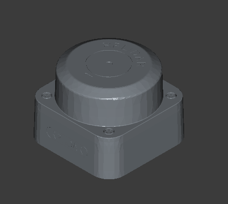
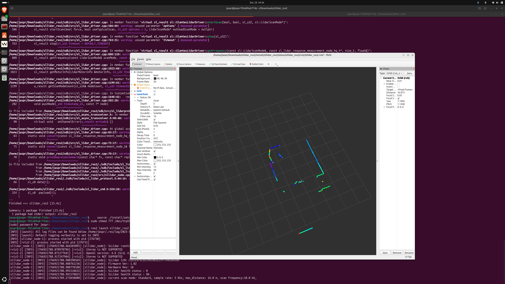
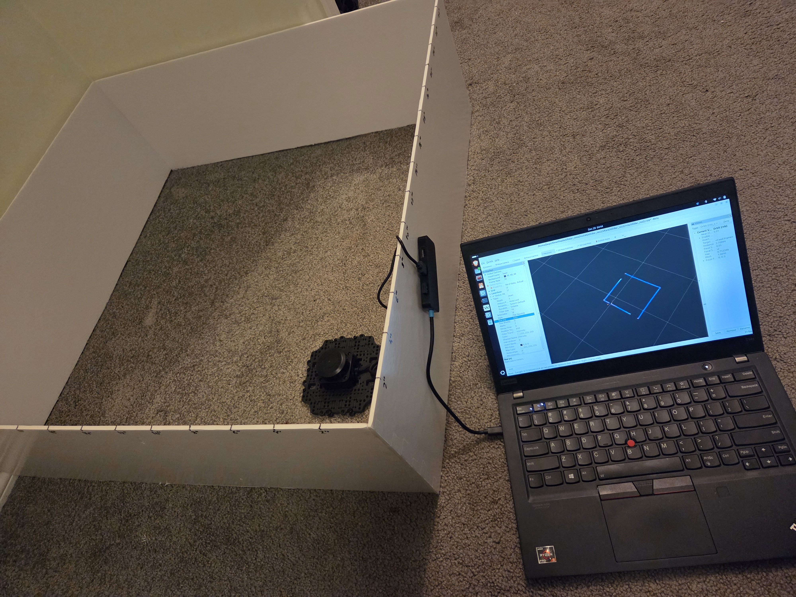

# RPLIDAR C1 Setup Guide

This guide will walk you through setting up the RPLIDAR C1 sensor for the TUTbot robot.

RPLIDAR C1 uses Time-of-Flight (ToF) and triangulation for distance measurement.

For installation and usage instructions, refer to the official repository:
[https://github.com/Slamtec/sllidar_ros2](https://github.com/Slamtec/sllidar_ros2)

## Features:
- 12m ranging radius
- 0.05m blind zone 
- 10Hz (600RPM) scanning frequency
- 0.72° angular resolution
- 5000 sampling rate
- UART communication (460800 baud)
- 30mm ranging accuracy
- 230mA power consumption

## Testing

To verify the RPLIDAR is working correctly:
1. Connect the RPLIDAR to UART to type-C converter
2. Connect the converter to the robot's USB port

    The lidar should be detected at `/dev/ttyUSB0`
    Give additional permissions: `sudo chmod 777 /dev/ttyUSB0`

3. Run `ros2 launch sllidar_ros2 view_sllidar_c1_launch.py` to start the RPLIDAR driver

### Rviz Display
Once the driver is running, open Rviz to visualize the LIDAR data

I created a 30x30x10" enclosure to perform basic tests. The Lidar measured distances accurately within the expected range (~74cm).