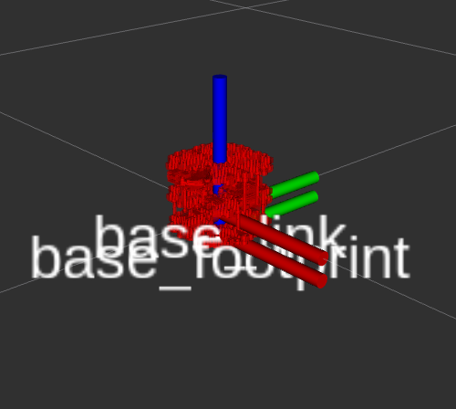
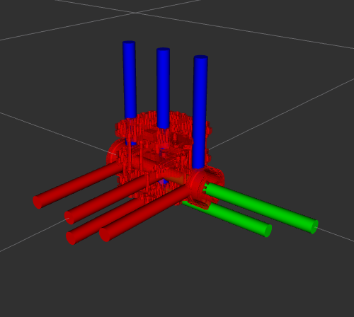
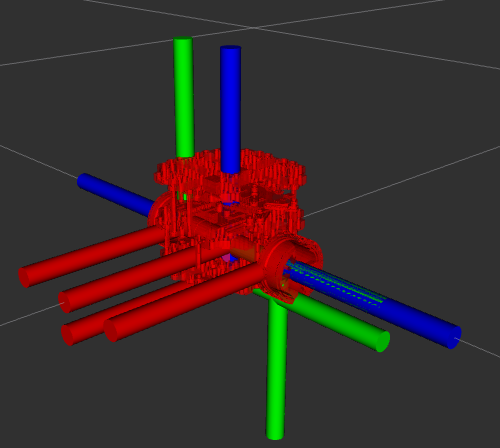

# URDF Setup

## Why create a URDF?
It is useful to have a code-independent, human-readable way to describe the geometry of the robot. One of the ways to achieve this is through URDF. The Unified Robot Description Format (URDF) is an XML-based format that describes a robot's structure, links, joints, and visual properties.

This allows us to define the robot's physical components in a standardized way that can be used by various ROS tools and simulation environments like RViz and Gazebo.

```bash
sudo apt-get install ros-jazzy-urdf-tutorial
```
Make sure to source your workspace: `. install/setup.bash`
```bash
ros2 launch urdf_tutorial display.launch.py model:=/home/jaspr/Documents/TUTbot/ros_test_ws/src/bumperbot_description/urdf/bumperbot.urdf.xacro
```
<p align="center">
  
  <br>
  <em>URDF visualization of the bumperbot base footprint and base link. The base_footprint is the origin frame, and the base_link represents the main body of the robot.</em>
</p>

Now let's add the wheel links to our URDF:

We'll add two wheel links to our URDF - one for the left wheel and one for the right wheel. Each wheel will be defined as a link with a visual geometry, and we'll connect them to the base link using joints.

URDF allows defining two origins one at the link level and one at the joint level. The link origin defines the pose of the link's origin relative to the link frame, while the joint origin defines the transformation from the parent link's origin to the child link's origin.

This means we can control where the visual mesh of a link is positioned relative to the link frame, and we can also control where the joint connects between two links. Here is a visual example if we set roll to 90 degrees to rotate the wheel mesh in (i) the link frame, and (ii) the joint frame. Set the joint type to continuous for rotational joints.
<p align="center">
  
  
  <br>
  <em>Left: Link origin rotation. Right: Joint origin rotation.</em>
</p>

Similarly, we can add the caster wheels in the same way, using fixed joints to attach them to the base link.

The complete URDF should now include all the links and joints we've defined, allowing us to visualize the entire robot in RViz.

Using the joint state publisher GUI, we can control the joint angles of the robot and see the changes in real-time in RViz.

<p align="center">
  
  <br>
  <em>Joint state publisher GUI for controlling robot joints.</em>
</p>