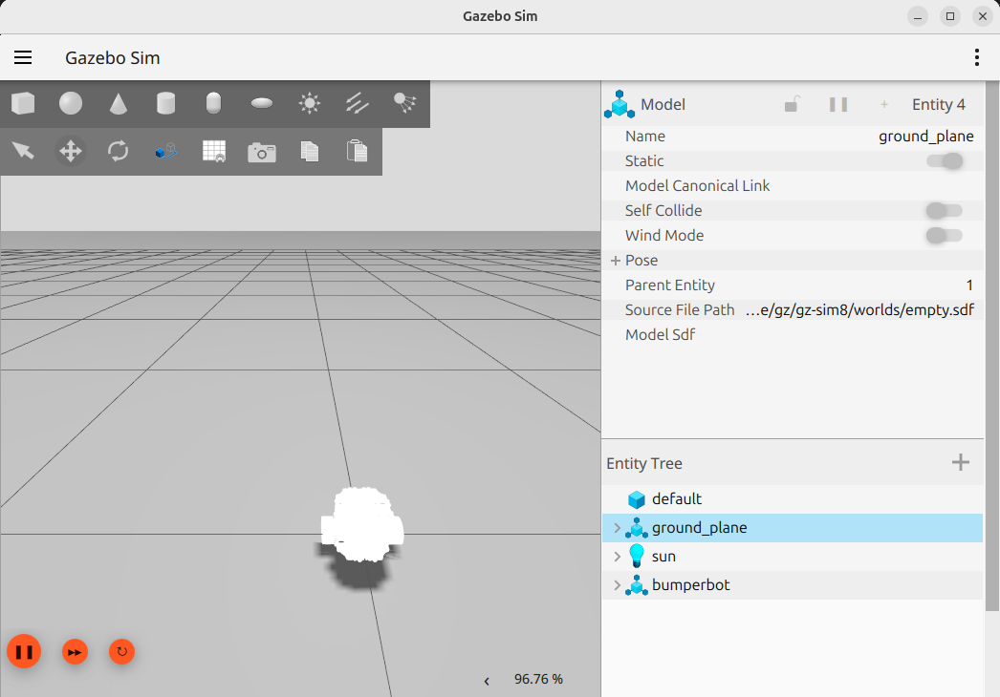

# URDF Setup

## Why create a URDF?
It is useful to have a code-independent, human-readable way to describe the geometry of the robot. One of the ways to achieve this is through URDF. The Unified Robot Description Format (URDF) is an XML-based format that describes a robot's structure, links, joints, and visual properties.

This allows us to define the robot's physical components in a standardized way that can be used by various ROS tools and simulation environments like RViz and Gazebo.

```bash
sudo apt-get install ros-jazzy-urdf-tutorial
```
Make sure to source your workspace: `. install/setup.bash`
```bash
ros2 launch urdf_tutorial display.launch.py model:=/home/jaspr/Documents/TUTbot/ros_test_ws/src/bumperbot_description/urdf/bumperbot.urdf.xacro
```
<p align="center">
  
  <br>
  <em>URDF visualization of the bumperbot base footprint and base link. The base_footprint is the origin frame, and the base_link represents the main body of the robot.</em>
</p>

Now let's add the wheel links to our URDF:

We'll add two wheel links to our URDF - one for the left wheel and one for the right wheel. Each wheel will be defined as a link with a visual geometry, and we'll connect them to the base link using joints.

URDF allows defining two origins one at the link level and one at the joint level. The link origin defines the pose of the link's origin relative to the link frame, while the joint origin defines the transformation from the parent link's origin to the child link's origin.

This means we can control where the visual mesh of a link is positioned relative to the link frame, and we can also control where the joint connects between two links. Here is a visual example if we set roll to 90 degrees to rotate the wheel mesh in (i) the link frame, and (ii) the joint frame. Set the joint type to continuous for rotational joints.
<p align="center">
  
  
  <br>
  <em>Left: Link origin rotation. Right: Joint origin rotation.</em>
</p>

Similarly, we can add the caster wheels in the same way, using fixed joints to attach them to the base link.

The complete URDF should now include all the links and joints we've defined, allowing us to visualize the entire robot in RViz.
Using the joint state publisher GUI, we can control the joint angles of the robot and see the changes in real-time in RViz.

<p align="center">
  
  <br>
  <em>Joint state publisher GUI for controlling robot joints.</em>
</p>

<hr>
The URDF_tutorial sets up RVIZ and the robot_state_publisher and joint_state_publisher to visualize the robot. We can do this manually by launching the necessary nodes. 

1. Run the robot_state_publisher and provide it with the URDF file in XML format.

  The robot_state_publisher requires the URDF to be in XML format, which is why we use xacro to convert our .xacro file to .xml. We can describe it as a robot_description parameter that is passed as a ROS parameter.

  ```bash
  ros2 run robot_state_publisher robot_state_publisher --ros-args -p robot_description:="$( xacro /home/jaspr/Documents/TUTbot/ros_test_ws/src/bumperbot_description/urdf/bumperbot.urdf.xacro)"
  ```
  
2. Run the joint_state_publisher_gui to control the joints.

  ```bash
  ros2 run joint_state_publisher_gui joint_state_publisher_gui
  ```

3. Run RViz to visualize the robot.

  ```bash
  ros2 run rviz2 rviz2
  ```

  3.1. For RVIZ to work properly, set the Fixed Frame to "base_footprint" in the Displays panel.\
  3.2. Add TF display to see the robot's coordinate frames.\
  3.3. Add RobotModel display to see the robot mesh. Set the Description topic to `/robot_description`.

This should then be saved into bumperbot_description/launch/ as a RVIZ configuration file (e.g., `display.rviz`).

With all these, we can visualize the robot model as the urdf_tutorial does.

This setup has multiple steps and is quite cumbersome to set up manually. You can use this launch file: [display.launch.py](../ros_test_ws/src/bumperbot_description/launch/display.launch.py) to automate the process.

```bash
ros2 launch bumperbot_description display.launch.py
```

# Gazebo Setup

## Why use Gazebo?

Gazebo is a 3D simulation environment that allows us to simulate the robot's behavior in a virtual world. It provides physics simulation, sensor simulation, and visualization capabilities.

For Gazebo to work with our existing setup, we need to define collision tags for each link in our URDF file. These collision tags define the shape and size of each link for physics simulation purposes. Since a mesh is a very complex geometry, it would be a good idea to use simpler collision shapes like boxes, cylinders, or spheres for better performance. For castors and wheels, I have defined spheres as collision shapes. Look for the `<collision>` tags in the [bumperbot.urdf.xacro](../ros_test_ws/src/bumperbot_description/urdf/bumperbot.urdf.xacro) file.

Next, we also need to define inertia properties for each link. These are defined using `<inertial>` tags in the URDF file. These can be generated using plugins for solidworks. The rest of the parameters required for Gazebo are in the [bumperbot_gazebo.urdf.xacro](../ros_test_ws/src/bumperbot_description/urdf/bumperbot_gazebo.urdf.xacro) file. This file is included within the bumperbot.urdf.xacro file and contains friction coefficients, damping values, and other physical properties needed for simulation. 

These parameters define how each link physically interacts with the ground in Gazebo’s contact model. The parameters mu1 and mu2 are the Coulomb friction coefficients in two orthogonal directions within the contact plane; setting them to extremely large values effectively enforces no slipping in either the rolling or lateral direction, which is a common but unphysical shortcut to guarantee perfect traction. The parameter kp is the contact stiffness, controlling how hard the wheel–ground contact is and how much penetration is allowed before a restoring force is applied, while kd is the contact damping term that dissipates energy and stabilizes the contact response to prevent oscillations or bouncing. The minDepth value specifies the minimum penetration depth required before contact forces are generated, helping to filter numerical noise, and maxVel limits the maximum corrective velocity used to resolve interpenetration, which improves numerical stability. Finally, fdir1 defines the primary friction direction in the link’s local frame.


See the [gazebo.launch.py](../ros_test_ws/src/bumperbot_bringup/launch/gazebo.launch.py) file for the gz launch configuration.

<p align="center">
  
  <br>
  <em>Gazebo simulation of the robot with visualized joints.</em>
</p>
